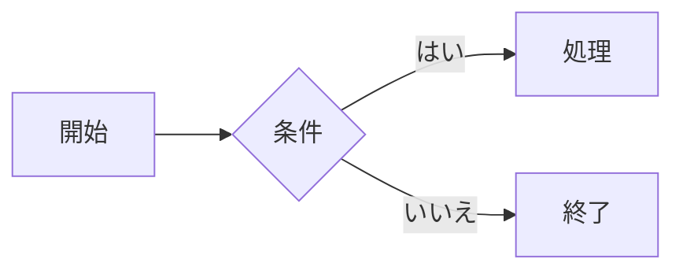
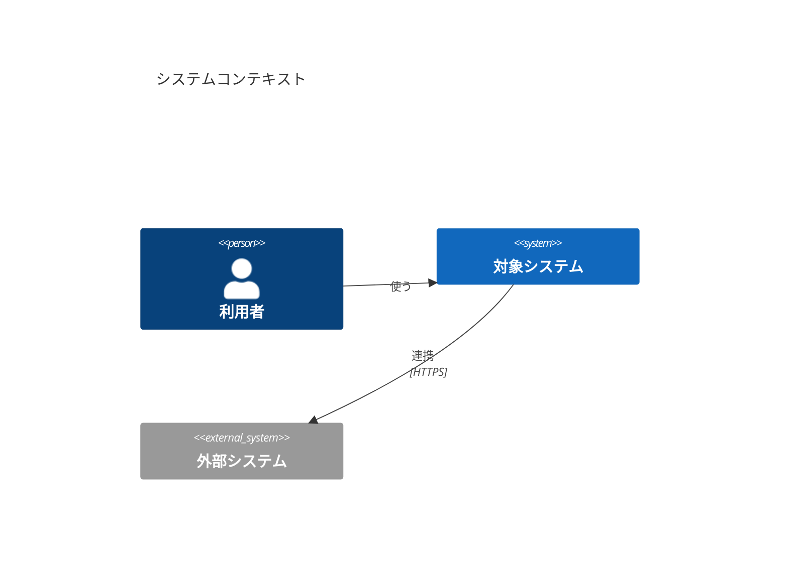

# Markdown-Viewer（Markdown Preview）

Windows 向けの軽量な Markdown プレビュー／エディタアプリです（Tauri v2 + WebView2）。
Mermaid（C4 含む）・Graphviz・WaveDrom の図もアプリ内で描画し、**外部と一切通信せずオフラインで動作**します。

- 外部エディタ（VS Code など）で保存すると、プレビューが自動で更新される
- アプリ内でも編集でき、エディタとプレビューを左右に並べて表示できる
- 複数のファイルを**タブ**で開いて同時に編集できる（次回起動時に前回のタブを開き直す）
- スクリーンショットを貼り付けると、保存時に「md の名前.assets」フォルダへ画像も一緒に保存
- PDF 出力（プレビューで確認してから保存）
- C4 図を**フォームで作る・直せる**図のビルダー（箱をドラッグして並べる・好きな位置に置く、箱から箱へドラッグして線を引く、線をクリックして向きを変える）
- ツールバー左の**パス表示**（開いている md のフルパス）をクリックするか、**ファイル → パスをコピー** で、パスをクリップボードにコピー
- 書き方ヘルプ（F1）で Markdown / Mermaid / C4 などの書き方をすぐ確認できる（各図の使用技術と、公式の書き方ページへのリンク付き）
- バージョンアップ機能（GitHub の最新リリースを確認して、ワンクリックで更新）

---

## 目次

- [動作環境](#動作環境)
- [インストール](#インストール)
- [使い方](#使い方)
  - [ファイルを開く](#ファイルを開く)
  - [ファイルパネル](#ファイルパネル)
  - [表示モード（編集 / 分割 / プレビュー）](#表示モード編集--分割--プレビュー)
  - [編集と保存](#編集と保存)
  - [外部エディタと一緒に使う](#外部エディタと一緒に使う)
  - [画像を貼り付ける](#画像を貼り付ける)
  - [画像に注釈を付ける](#画像に注釈を付ける)
  - [図を書く（Mermaid / C4 / Graphviz / WaveDrom）](#図を書くmermaid--c4--graphviz--wavedrom)
  - [図や画像を拡大して見る](#図や画像を拡大して見る)
  - [PDF に出力する](#pdf-に出力する)
  - [書き方ヘルプ](#書き方ヘルプ)
  - [テーマ・ズーム](#テーマズーム)
  - [バージョンアップ](#バージョンアップ)
- [キーボードショートカット](#キーボードショートカット)
- [注意事項・制限](#注意事項制限)
- [開発者向け](#開発者向け)

---

## 動作環境

| 項目 | 内容 |
|---|---|
| OS | Windows 10 / 11（x64） |
| ランタイム | Microsoft Edge WebView2 Runtime（Windows 11 は標準搭載。Windows 10 も通常は導入済み） |
| ネットワーク | 不要（完全オフラインで動作） |

## インストール

### インストーラを使う（おすすめ）

1. `Markdown Preview_x.y.z_x64-setup.exe` を実行する（管理者権限は不要。ユーザー単位でインストール）
2. スタートメニューの **Markdown Preview** から起動する
3. `.md` / `.markdown` / `.mdown` / `.mkd` がこのアプリに関連付けられ、ダブルクリックで開ける
4. これらのファイルを右クリックすると **MDプレビューで開く** が表示される（Windows 11 では「その他のオプションを確認」の中。既定のアプリを別のアプリにしていても使える）

> インストーラはソースからビルドすると `src-tauri/target/release/bundle/nsis/` に作られます（[開発者向け](#開発者向け)参照）。

### インストールせずに使う

ビルド済みの `src-tauri/target/release/markdown-preview.exe` を直接起動できます（この場合、拡張子の関連付けは登録されません）。

---

## 使い方

### ファイルを開く

次のどれでも開けます。

| 方法 | 操作 |
|---|---|
| ダイアログ | **ファイル → 開く…** または **Ctrl+O**（複数選択可） |
| パスで開く | **ファイル → パスで開く…** または **Ctrl+Shift+O** で、パスを入力・貼り付けして Enter（エクスプローラーの「パスのコピー」で付く `"` はそのままでよい。フォルダのパスなら作業フォルダとしてファイルパネルに表示） |
| ドラッグ＆ドロップ | `.md` ファイルをウィンドウにドロップ（複数可。プレビュー表示なら分割表示に切り替わり、すぐ編集できる） |
| ダブルクリック | インストール後は `.md` をダブルクリック |
| 右クリック | インストール後は `.md` を右クリック → **MDプレビューで開く** |
| コマンドライン | `markdown-preview.exe C:\path\to\file.md` |

開いたファイルは**タブ**で並びます（すでに開いているファイルはそのタブに切り替わります）。アプリがすでに起動しているときに別のファイルを開くと、新しいウィンドウは増えずに、既存のウィンドウの新しいタブで開きます。
プレビュー内の相対リンク（`[次へ](./next.md)`）をクリックすると、そのファイルを新しいタブで開きます。外部 URL は既定のブラウザで開きます。

#### タブ

- クリックで切り替え、**×** / 中クリック / **Ctrl+W** で閉じる。**Ctrl+Tab** / **Ctrl+Shift+Tab** で次 / 前のタブ
- 編集内容・カーソル・元に戻す（Ctrl+Z）の履歴はタブごとに残ります。未保存のタブには **•** が付きます
- 未保存のタブを閉じるときや、未保存のタブがある状態でウィンドウを閉じるときは確認が出ます
- 次に起動したときは、前回開いていたタブを開き直します（未保存の変更は持ち越しません）

### ファイルパネル

画面の右側に、**作業フォルダ**の中の Markdown（`.md` / `.markdown` / `.mdown` / `.mkd` / `.txt`）をツリーで表示します。ファイルを次々に開き替えたいときに使います。

- ツールバーの **ファイル**、**表示 → ファイルパネル**、**Ctrl+B** のどれかで開閉します（最初は閉じています）。パネル左端の境界線をドラッグすると幅を変えられます。開閉と幅は次回の起動時にも引き継がれます
- **作業フォルダ**: パネル上部の **選ぶ…** で選ぶか、フォルダをウィンドウにドロップします。初めて開いたときは、表示中のファイルのフォルダになります。次回の起動時も同じフォルダを表示します
- **シングルクリック**で**お試しタブ**に開きます。お試しタブは 1 つだけで（タブ名が斜体）、別のファイルをクリックすると中身が置き換わるので、タブが増えません
- **ダブルクリック**で**通常タブ**に開きます。お試しタブも、編集する・タブをダブルクリックすると通常タブになります。**開く**やドロップで開いたファイルは最初から通常タブです
- 表示中のファイルが作業フォルダ内にあれば、ツリーで強調し、途中のフォルダを開きます
- ファイルの追加・削除は自動で反映されます（**⟳** で手動でも更新できます）
- `.` で始まるフォルダ（`.git` など）と `node_modules` は表示しません
- パネルの下部に**最近使ったフォルダ**（最近作業フォルダにしたフォルダ）を表示します（今の作業フォルダを除き、新しい順）。件数は **設定** の「最近使ったフォルダの表示件数」で 0〜20 件に変えられます（既定は 5 件。0 で非表示）。クリックするとそのフォルダを作業フォルダに切り替えます。見つからなくなったフォルダは、クリックしたときに一覧から外れます
- 右クリックで **パスをコピー** / **エクスプローラーで表示**
- キーボード: **↑↓** 移動、**→←** フォルダの開閉、**Enter** 通常タブで開く、**Space** お試しタブで開く
- 使わないときは **設定**（Ctrl+,）の「ファイルパネルを使う」をオフにすると、ボタン・メニューと Ctrl+B も無効になります

### 表示モード（編集 / 分割 / プレビュー）

ツールバー右側のボタン、**表示** メニュー、ショートカットのどれかで切り替えます。

| モード | キー | 内容 |
|---|---|---|
| 編集 | Ctrl+1 | エディタのみ |
| 分割 | Ctrl+2 | 左にエディタ、右にプレビュー。カーソルのある箇所を、プレビューでもカーソルと同じ高さに表示する（設定の「分割表示でプレビューをカーソルの位置に合わせる」をオフにすると、エディタの一番上の行に合わせる）。境界線はドラッグで幅を変更できる。プレビューの文をクリックすると、エディタのカーソルがその文字の位置へ移る |
| プレビュー | Ctrl+3 | プレビューのみ（閲覧用） |

編集モードからプレビュー（または分割）に切り替えると、エディタのカーソルがあった箇所を表示します。
プレビューに切り替えたときは、その箇所を薄く色付けします。分割表示では、エディタのカーソルがある箇所を常にプレビューで色付けします（色とオン/オフは **ツール → 設定…**（Ctrl+,）で変更できます）。

### 編集と保存

- **新規**（Ctrl+N）・**保存**（Ctrl+S）・**名前を付けて保存**（Ctrl+Shift+S）。どれも **ファイル** メニューにもあります
- 未保存の変更があると、タイトルとタブの名前の横に `•` が付きます。そのタブやウィンドウを閉じるときは確認が出ます
- エディタ内では **Ctrl+F** で検索、**Ctrl+H** で置換ができます（置換欄の `\n` は改行になります）
- VS Code と同じ操作で、カーソルを複数置いてまとめて編集できます（**Ctrl+D** で次の一致を追加、**Ctrl+Shift+L** ですべての一致を選択、**Alt+クリック** でカーソルを追加、**Shift+Alt+ドラッグ** で矩形選択）。例: `;` を選んで Ctrl+Shift+L → **→** → **Enter** で、すべての `;` の後ろで改行
- F5 でファイルをディスクから読み直します

### 外部エディタと一緒に使う

VS Code などで同じファイルを編集して保存すると、プレビューが自動で更新されます（スクロール位置は保たれます）。
このアプリ側に未保存の編集がある状態で外部から変更されたときは、画面上部のバナーで **再読み込み / 無視** を選べます。

### 画像を貼り付ける

1. スクリーンショットなどの画像をクリップボードにコピーする
2. **編集** か **分割** モードで、エディタに **Ctrl+V**
3. カーソル位置に `` のようなリンクが入り、プレビューにすぐ表示される
4. **Ctrl+S** で保存すると、md ファイルと同じフォルダの「md の名前.assets」フォルダに画像ファイルが書き出される（md ごとに別のフォルダ）
5. 無題の文書では仮に `untitled.assets/` と入り、初めて保存したときに保存した名前のフォルダへ書き換わります

```
資料/
├─ 設計書.md
└─ 設計書.assets/
   ├─ image-20261002-111800.png
   └─ image-20261002-112015.png
```

- 保存する前に本文からリンクを消した画像は、ファイルとして書き出されません
- 既存の画像は、相対パスで `` のように書けば表示されます（md ファイルの場所が基準）

### 画像に注釈を付ける

画面キャプチャなどに、矢印・赤字のコメント・四角の枠・番号マーカー（① ② ③）を重ねられます（Excel で図形やテキストボックスを置く代わり）。

1. プレビューの画像を**右クリック →「注釈を編集…」**（またはカーソルを画像の行に置いて **Ctrl+Shift+A**。**図** / Ctrl+Shift+D でも開く）
2. 右側で道具を選んで描く。**矢印**・**枠**はドラッグ、**テキスト**・**番号**（番号マーカー）はクリック。テキストは「背景を白で塗る」も選べる。**選択**でドラッグして移動、● で形を変える。**Delete** で削除、**Ctrl+Z** で元に戻す
3. **適用**すると md を次の形に書き換え、md を**保存したとき**に、元画像の隣へ注釈を描き込んだ `<元の名前>.annotated.png` を書き出す（同じ画像に別の注釈を付けると `.annotated-2.png`… と別のファイルになり、上書きしない）

```markdown

<!-- annotate {"src":"form.png","size":[1280,720],"items":[...]} -->
```

- GitHub など他のビューアでは、描き込んだ画像（`form.annotated.png`）が見えます
- このアプリでは元画像（`form.png`）の上に注釈を描き直すので、あとから何度でも直せます。拡大縮小や PDF でもずれません
- 注釈を全部消して適用すると、元の画像の参照に戻ります（書き出した画像は残ります）
- 貼り付けたばかりの画像や無題の md にも、保存せずに注釈できます（保存せずに閉じれば何も残りません）。ファイルにある画像を無題の md で使うときだけ、先に保存してください
- URL の画像（`https://...`）には使えません。注釈は行の最後の画像に付きます
- 番号マーカーと要望の表は自動では対応しません。画像の下に「No. ｜ 要望」の表を書いてください（ヘルプに例があります）

### 図を書く（Mermaid / C4 / Graphviz / WaveDrom）

コードブロックの言語名で図の種類を指定します。

| 言語名 | 図 |
|---|---|
| `mermaid` | フローチャート、シーケンス図、クラス図、状態遷移図、ER 図、ガント、円グラフ、マインドマップ、タイムライン、Git グラフ、C4 など |
| `dot` / `graphviz` | Graphviz（DOT 言語） |
| `c4` | C4 モデル（Mermaid / C4-PlantUML と同じ書き方を Graphviz で描く。線が箱を避け、`Rel_R` / `Lay_D` などで配置を指定できる） |
| `wavedrom` | タイミングチャート、レジスタ図 |

````markdown

````

````markdown

````

書き方に誤りがあると、図の位置に赤枠でエラー内容が表示されます。
各図の詳しい書き方は、[書き方ヘルプ](#書き方ヘルプ)（F1）に例付きでまとまっています。

### 図や画像を拡大して見る

横に長い構成図など、本文の幅に縮んで読めない図や画像は、**拡大ビューア**で大きくして見られます。

1. プレビューの図や画像を**クリック**する（または右クリック →「**拡大して見る**」）
2. ウィンドウいっぱいに、全体が収まる大きさで表示される
3. **マウスホイール**でマウスの位置を中心に拡大縮小、**ドラッグ**で移動する。`0` で全体表示、`1` で実寸（100%）、`+` / `-` でも拡大縮小できる
4. **Esc**、右上の **×**、図の外の暗い部分のクリックで閉じる

- 対象は Mermaid・Graphviz・C4・WaveDrom の図と、Markdown の画像です。プレビュー表示と分割表示の右側で使えます
- 図は拡大しても文字がぼけません。注釈を付けた画像は、注釈を重ねたまま拡大します
- 表示を重ねるだけなので、MD・PDF・エクスポートの結果は変わりません。開いている間は、ほかのショートカットは効きません

### PDF に出力する

1. **ファイル → PDF に出力…** か **Ctrl+P** を選ぶ
2. PDF プレビューが表示されるので、内容とページ区切りを確認する
3. **保存…**（または Ctrl+S）を押し、保存先を選ぶ（保存後、エクスプローラーで場所が開く）
4. 紙に印刷したいときは、プレビュー右上の印刷ボタンを使う。**閉じる**（Esc）で編集に戻る

- ダークモードで表示していても、PDF は白地・ライト配色で出力されます
- 出力されるのはプレビュー部分だけです（メニューやエディタは含まれません）。図や表がページの途中で切れないように調整されます。横に長いコードや表は、ページの幅で折り返します

### 書き方ヘルプ

**F1** か **ヘルプ → 書き方ヘルプ** で、書き方集を別ウィンドウで開きます（オフラインで動作）。

| セクション | 内容 |
|---|---|
| Markdown 基本 | 見出し、強調、リスト、タスクリスト、リンク、画像、引用、コード、表、脚注、折りたたみ、エスケープ |
| Mermaid | フローチャート（形・矢印・サブグラフ・色）、シーケンス、クラス、状態、ER、ガント、円、マインドマップ、タイムライン、Git、ジャーニー、4象限 |
| C4 モデル（Mermaid） | コンテキスト図、コンテナ図、コンポーネント図、線の重なりの調整、色の変更 |
| Graphviz | 有向グラフ、ノードの形、クラスタ、無向グラフ、レコード |
| C4 モデル（Graphviz） | コンテキスト図、コンテナ図、配置の指定（`Rel_R` / `Lay_D`）、線の交差を減らすコツ、横向き、直角の線、色の変更 |
| WaveDrom | 信号、グループ、矢印、レジスタ図 |
| アプリの使い方 | ショートカット、タブ、図のビルダー、画像の貼り付け、PDF 出力など |

- 各項目は「書き方」と「実際の表示」を並べて表示します
- **コピー** でクリップボードにコピー、**エディタに挿入** でメインウィンドウのカーソル位置に挿入されます
- 左上の検索欄（Ctrl+F）で項目を絞り込めます（例: `表`、`シーケンス`、`C4`）。Esc で閉じます

### テーマ・ズーム

- **テーマ**: **表示 → テーマ** で **自動**（Windows の設定に合わせる）・**ライト**・**ダーク** から選びます（**設定** からも選べます）。メニューバーの色もテーマに合わせて変わります。設定は次回の起動時にも引き継がれ、ヘルプウィンドウにも反映されます
- **ズーム**: **Ctrl+マウスホイール** で、マウスの下にあるペイン（プレビュー／エディタ）を個別に拡大縮小できます。Ctrl+＋ / Ctrl+− / Ctrl+0（100%）も使えます。ツールバーの倍率表示をクリックすると 100% に戻ります

### バージョンアップ

起動時に、このリポジトリの [GitHub Releases](https://github.com/mazume-tech-club/Markdown-Viewer/releases) に新しいバージョンがないかを確認します。

1. 新しいバージョンがあると、画面上部に「新しいバージョン vX.Y.Z が利用できます」と表示される
2. **更新して再起動** を押すと、ダウンロード → インストール → 再起動が自動で行われる（**変更内容** でリリースノートを確認、**後で** で閉じる）
3. 手動で確認したいときは、**ヘルプ → 更新を確認** を選ぶ

- ネットワークに接続するのは、この確認とダウンロードのときだけです。オフラインのときは何も表示されません
- 起動時の自動確認は、**設定** の「起動時に自動で更新を確認」で止められます
- 更新後の再起動では、開いていたファイルを開き直します。未保存の変更も残したまま復元されます（まだ保存されていない状態で戻ります）。ダウンロード中は編集できません
  - **設定** の「更新時、未保存の変更を再起動後に復元」をオフにすると、未保存の変更は復元せず、更新前に破棄してよいかを確認します
  - 貼り付けた画像が未保存のときは、復元できないため先に保存するよう確認が出ます
- 更新ファイルは署名を検証してからインストールされます
- セキュリティソフトなどに更新を止められたときは、アプリはそのまま使える状態で残り、お知らせに **再試行** と **手動でダウンロード**（リリースページを開く）が表示されます
- v1.0.0 には更新機能がないため、v1.1.0 だけは手動でインストールしてください

---

## キーボードショートカット

| キー | 動作 |
|---|---|
| Ctrl+N | 新しいタブ（無題） |
| Ctrl+O | 開く（複数選択可） |
| Ctrl+Shift+O | パスで開く |
| Ctrl+W | 表示中のタブを閉じる |
| Ctrl+Tab / Ctrl+Shift+Tab | 次 / 前のタブ（Ctrl+PageDown / PageUp も可） |
| Ctrl+S / Ctrl+Shift+S | 保存 / 名前を付けて保存 |
| Ctrl+P | PDF プレビュー（プレビュー中は Ctrl+S で保存、Esc で閉じる） |
| Ctrl+Shift+D | 図のビルダー（C4 図をフォームで作る・カーソル位置の図を直す）。カーソルが画像の行なら画像の注釈 |
| Ctrl+Shift+A | 画像の注釈（矢印・テキスト・枠・番号を画像に重ねる） |
| Ctrl+Shift+C | 開いているファイルのパスをコピー |
| Ctrl+1 / Ctrl+2 / Ctrl+3 | 編集 / 分割 / プレビュー |
| Ctrl+B | ファイルパネルの開閉 |
| Ctrl+V（エディタ） | クリップボードの画像を貼り付け |
| Ctrl+F / Ctrl+H（エディタ） | 検索 / 置換 |
| Ctrl+D / Ctrl+Shift+L（エディタ） | 次の一致を選択に追加 / すべての一致を選択 |
| Alt+クリック / Ctrl+Alt+↑↓（エディタ） | カーソルを追加 |
| Tab / Shift+Tab（エディタ） | タブ文字を入力（範囲選択中は字下げ） / 字下げを戻す |
| Ctrl+ホイール | マウスの下のペインを拡大縮小 |
| Ctrl+＋ / Ctrl+− / Ctrl+0 | 拡大 / 縮小 / 100% |
| プレビューの図・画像をクリック | 拡大ビューアで開く（ホイールで拡大縮小・ドラッグで移動・Esc で閉じる） |
| Ctrl+, | 設定 |
| F1 | 書き方ヘルプ |
| F5 | ファイルを再読み込み |
| Alt+F / Alt+E / Alt+V … | メニューバーのメニューを開く |

---

## 注意事項・制限

- **文字コード**: UTF-8（BOM 付き含む）を前提にしています。UTF-8 として読めないファイルは Shift_JIS として読み込み、保存するときは UTF-8 で書き出します
- **ネット上の画像**: 外部と通信しない設計のため、`https://...` の画像は表示されません。画像はローカルに置いて相対パスで参照してください
- **名前を付けて保存**: 別のフォルダに保存しても、すでに保存済みの「md の名前.assets」内の画像はコピーされません（未保存の貼り付け画像は新しい場所に書き出されます）
- **Mermaid の C4 図**: 自動でレイアウトされないため、線が重なることがあります。`UpdateLayoutConfig($c4ShapeInRow="2")` で 1 行の要素数を変えたり、`UpdateRelStyle(...)` でラベルの位置をずらしたりして調整してください（ヘルプの「線の重なり・余白を調整する」、`samples/demo.md` 参照）。線の経路や配置を制御したいときは、同じ書き方のまま ```` ```c4 ```` ブロック（Graphviz で描画）に変えてください
- **HTML**: Markdown 内の HTML は使えますが、スクリプトなど危険な要素は自動で取り除かれます
- **アンインストール**: 「設定 > アプリ > インストールされているアプリ」から行ってください。Markdown Preview が起動していると確認が出ます。「OK」で終了して続行、「キャンセル」で中止します（保存していない編集内容は、OK で終了すると失われます）。インストール先を変えて入れ直したときは、前のインストール先が自動で削除されます

---

## 開発者向け

### 必要なもの

| ツール | バージョンの目安 |
|---|---|
| Node.js | 20 以上（22 で動作確認） |
| Rust | stable（`x86_64-pc-windows-msvc`） |
| Visual Studio Build Tools | 2022（「C++ によるデスクトップ開発」） |
| WebView2 Runtime | Windows 11 は標準搭載 |

### コマンド

```powershell
npm install              # 依存パッケージのインストール
npm run tauri dev        # 開発モードで起動（ホットリロード）
npm run tauri build      # リリースビルド（exe とインストーラを作成）
npx tsc --noEmit         # 型チェック
cd src-tauri; cargo test # Rust の単体テスト
```

ビルドの成果物:

| ファイル | 内容 |
|---|---|
| `src-tauri/target/release/markdown-preview.exe` | アプリ本体（単体で起動可） |
| `src-tauri/target/release/bundle/nsis/Markdown Preview_x.y.z_x64-setup.exe` | インストーラ |

### リリース手順

GitHub Actions（`.github/workflows/release.yml`）がビルド・署名・Release 作成を自動で行います。

1. `package.json` / `src-tauri/Cargo.toml` / `src-tauri/tauri.conf.json` の `version` を上げてコミット
2. タグを付けて push する

   ```powershell
   git tag v1.2.0
   git push origin main v1.2.0
   ```

3. Actions が完了すると Release が公開され、インストーラ・署名（`.sig`）・`latest.json` が添付される。インストール済みのアプリは次の起動時に更新を検知する

| Secrets | 内容 |
|---|---|
| `TAURI_SIGNING_PRIVATE_KEY` | 更新ファイルに署名する秘密鍵 |
| `TAURI_SIGNING_PRIVATE_KEY_PASSWORD` | 秘密鍵のパスワード |

> 秘密鍵をなくすと、インストール済みのアプリへ更新を配信できなくなります。鍵は安全な場所にバックアップしてください（公開鍵は `tauri.conf.json` の `plugins.updater.pubkey`）。

### フォルダ構成

```
├─ index.html / help.html     メイン画面 / ヘルプ画面
├─ src/
│  ├─ main.ts                 メイン画面（ファイル操作・表示モード・PDF・ズーム・設定など）
│  ├─ render.ts               Markdown → HTML（markdown-it + DOMPurify）
│  ├─ diagrams.ts             Mermaid / Graphviz / WaveDrom の描画
│  ├─ c4model.ts              C4 の書き方の読み書き（描画とビルダーで共通）
│  ├─ c4dot.ts                C4 の図を Graphviz の DOT に変換
│  ├─ builder/                図のビルダー（builder.ts: 画面、c4form.ts: C4 の入力フォーム）
│  ├─ annotations.ts          画像の注釈（形式の読み書き・SVG の重ね描き・PNG への焼き込み）
│  ├─ annotator/              注釈エディタ（画像の上で矢印・テキストなどを描く画面）
│  ├─ session.ts              前回開いていたタブの記録
│  ├─ filepanel.ts            ファイルパネル（作業フォルダのツリー）
│  ├─ editor.ts               エディタ（CodeMirror 6）
│  ├─ scrollsync.ts           分割表示のスクロール同期
│  ├─ sourcepos.ts            プレビューでクリックした文字からソースの位置を探す
│  ├─ theme.ts                ライト / ダークの切り替え
│  ├─ updater.ts              バージョンアップ（更新の確認・インストール）
│  ├─ help.ts, help.css       ヘルプ画面
│  └─ help/help.md            ヘルプの内容
├─ src-tauri/
│  ├─ src/lib.rs              Rust 側（ファイル入出力・変更監視・フォルダ一覧・PDF 出力・画像の読み書き）
│  ├─ tauri.conf.json         ウィンドウ・CSP・インストーラの設定
│  └─ capabilities/           フロントエンドに許可する権限
├─ docs/adr/                  設計判断の記録
├─ GLOSSARY.md                用語集
├─ .github/workflows/release.yml  タグ push でリリースを作成
└─ samples/demo.md            動作確認用のサンプル
```

### ヘルプの内容を追加・変更する

`src/help/help.md` を編集してビルドし直すと反映されます。書式は次のとおりです。

`````markdown
# セクション名 {#section-id}

## 項目名
説明文（Markdown で書ける。複数行可）
~~~~example
ここに書いた内容が「書き方」としてそのまま表示され、
同時に Markdown として描画した結果が右側に表示される
~~~~
`````
