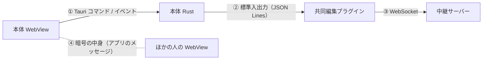

# 共同編集 プロトコル（版 1）

共同編集でやり取りするメッセージの形。仕様は [collaboration.md](collaboration.md)、用語は [GLOSSARY.md](../GLOSSARY.md) に従う。版 1 は段階 1 の範囲を扱う。段階 2・3 で足す予定の項目は、各節の「後の段階」に書いておく。

やり取りは 4 層になっている。



- ①〜③は、運ぶだけの層。中身（④）を解釈しない
- ④は WebView どうしの約束事。プラグインで暗号化され、中継サーバーは読めない

---

## 共通

| 項目 | 値 |
|------|----|
| プロトコルの版 | `1`（整数）。③の `hello` と②の `hello` で確かめる |
| セッション ID | 128 ビットの乱数を base64url（パディングなし、22 文字）にしたもの |
| ホスト用の合言葉 | 256 ビットの乱数を base64url にしたもの。ホストの接続を確かめるためだけに使う |
| 暗号の鍵 | 256 ビットの乱数。招待リンクの中にだけ置き、中継サーバーへは送らない |
| 接続 ID | 中継サーバーが、共同編集セッションの中で接続ごとに振る番号（1 から始まる 32 ビット符号なし整数）。0 は「全員宛て」の意味に使う |

### 招待リンク

```text
https://<中継サーバーのホスト名>/r/<セッション ID>#k=<暗号の鍵（base64url）>
```

- 暗号の鍵は `#` の後ろ（フラグメント）に置く。ブラウザで開いても、サーバーへは送られない
- 中継サーバーは `GET /r/<セッション ID>` に、「Markdown Preview の『共同編集に参加』に貼り付けてください」という案内のページを返す
- プラグインはリンクから、中継サーバーのホスト名・セッション ID・暗号の鍵を取り出す。形が違えば `bad-invite` を返す

---

## ③ プラグイン ⇔ 中継サーバー

### HTTP

| メソッドとパス | 役割 | 応答 |
|--------------|------|------|
| `POST /rooms` | 共同編集セッションを作る | `201` `{"v":1,"room":"<セッション ID>","hostSecret":"<ホスト用の合言葉>"}` |
| `GET /rooms/<セッション ID>` | WebSocket に切り替える（Upgrade） | `101`。セッションが無ければ `404` |
| `GET /r/<セッション ID>` | 招待リンクをブラウザで開いたときの案内 | `200` HTML |

- 中継サーバーが保存するのは、ホスト用の合言葉の SHA-256 だけ（Durable Object のストレージ）。文書は保存しない
- 共同編集セッションを作ってから 10 分以内にホストが接続しなければ、そのセッションを消す（Durable Object のアラームを使う）
- ホストが切れたら、全員の接続を閉じてセッションを消す

### WebSocket：文字のフレーム（制御用の JSON）

どのメッセージにも `t`（種類）を持たせる。

接続したら、10 秒以内に最初のメッセージとして `hello` を送る。送らなければ、中継サーバーは `4006` で閉じる。

#### プラグインから中継サーバーへ

| `t` | 送る人 | 中身 | 意味 |
|-----|-------|------|------|
| `hello` | 全員 | `v`, `role`（`"host"` / `"guest"`）, `name`, `secret`（ホストだけ） | 名乗る |
| `approve` | ホスト | `peer`（接続 ID） | 参加を承認する |
| `reject` | ホスト | `peer` | 参加を断る |

#### 中継サーバーからプラグインへ

| `t` | 受け取る人 | 中身 | 意味 |
|-----|----------|------|------|
| `ready` | 全員 | `you`（自分の接続 ID）, `host`（ホストの接続 ID） | 使えるようになった |
| `waiting` | 参加者 | なし | ホストの承認を待っている |
| `join-request` | ホスト | `peer`, `name` | 参加を求めている人がいる |
| `peers` | 承認済みの全員 | `peers`: `[{"peer":1,"name":"…","host":true}, …]` | 参加者の一覧が変わった |

- ホストは `hello` を送るとすぐに `ready` を受け取る
- 参加者は、`hello` の後に `waiting` を受け取る。ホストが承認したら `ready` を受け取り、断ったら `4003` で閉じられる
- `peers` は、誰かが承認されたときと、誰かが抜けたときに、承認済みの全員へ送る

#### 閉じるときの理由（WebSocket のクローズコード）

| コード | 意味 | 画面に出す言葉（例） |
|-------|------|------------------|
| `1000` | 普通に抜けた | — |
| `4000` | メッセージの形が違う | 「通信の形が正しくありません」 |
| `4001` | プロトコルの版が違う | 「ホストと版が違います。アプリを更新してください」 |
| `4002` | 共同編集セッションが無い | 「この招待リンクは終わっています」 |
| `4003` | ホストが参加を断った | 「参加を断られました」 |
| `4004` | 満員（ホストを含めて 10 人） | 「満員のため参加できません」 |
| `4005` | ホストが抜けた | 「ホストが共同編集を終えました」 |
| `4006` | `hello` が来なかった | 「接続に失敗しました」 |
| `4007` | ホスト用の合言葉が違う、またはホストがすでに接続している | 「共同編集を始められませんでした」 |

### WebSocket：バイナリのフレーム（暗号文）

承認済みの接続の間だけで受け渡す。承認前の接続から届いたバイナリは捨てる。

```text
プラグイン → 中継サーバー:  [宛先の接続 ID: u32 BE][暗号文]
中継サーバー → プラグイン:  [送り主の接続 ID: u32 BE][暗号文]
```

- 宛先が `0` なら、送り主以外の承認済みの全員へ送る。宛先が `0` 以外なら、その人だけに送る
- 中継サーバーは先頭の 4 バイトを差し替えるだけで、暗号文には触れない
- 1 フレームは 1 MiB まで。超えたら `4000` で閉じる（画像を分割して送るのは段階 3）

### 暗号文の形

```text
暗号文 = [ノンス: 12 バイト][AES-256-GCM の出力（中身 + タグ 16 バイト）]
AAD    = "mdp-collab/1" || セッション ID（ASCII） || 送り主の接続 ID（u32 BE）
```

- ノンスは、送るたびに 96 ビットの乱数にする
- AAD（暗号化されないが、改ざんを検出できる付加データ）に送り主の接続 ID を入れる。中継サーバーが送り主を差し替えると、受け取った側で復号に失敗する
  - 送り主は、`ready` で受け取った自分の接続 ID を使って暗号化する
  - 受け取った側は、フレームの先頭にある接続 ID で確かめる
- 復号に失敗したフレームは捨て、本体に `warning` を伝える

### 後の段階

- 段階 2：`hello` に `key`（参加用の鍵）を足す。`name` は鍵の中の名前を使い、`hello` の `name` は無視する。鍵が無い・期限切れ・無効なら、新しいコード `4008` で閉じる
- 段階 3：`approve` に `mode`（`"edit"` / `"view"`）を足す。ホストが短く切れた場合にはセッションを残しておき、戻ってくるのを待つ（再接続）

---

## ② 本体 Rust ⇔ プラグイン（標準入出力）

- 1 行に 1 つの JSON（UTF-8、改行は LF）
- バイナリは base64（標準、パディングあり）にする
- 本体からの依頼には `id`（数値）を付ける。プラグインは同じ `id` で `ok` か `fail` を返す
- `id` の無い行は、プラグインから本体へのお知らせ（イベント）

### 本体からプラグインへ（依頼）

| `t` | 中身 | `ok` の中身 | 意味 |
|-----|------|------------|------|
| `hello` | `v` | `v`, `plugin`（プラグインの版の文字列） | 起動直後に版を確かめる |
| `config-get` | なし | `relay`（中継サーバーの URL。未設定なら `null`） | 設定を読む |
| `config-set` | `relay` | なし | 設定を書く |
| `start` | `name` | `room`, `invite`（招待リンク） | 共同編集セッションを始める（ホスト） |
| `join` | `invite`, `name` | なし | 参加を求める（参加者） |
| `send` | `to`（接続 ID、0 は全員）, `data`（base64） | なし | 暗号化して送る |
| `approve` | `peer` | なし | 承認する（ホスト） |
| `reject` | `peer` | なし | 断る（ホスト） |
| `leave` | なし | なし | 抜ける。ホストなら共同編集セッションが終わる |

- 失敗したときは `{"id":3,"t":"fail","code":"…","message":"…"}` を返す
- `code` は次のいずれか
  - `no-relay`：中継サーバーが未設定
  - `bad-invite`：招待リンクの形が違う
  - `network`：中継サーバーにつながらない
  - `busy`：すでに共同編集セッション中
  - `not-in-session`：共同編集セッション中ではない（`ready` を受け取る前の `send` も含む）
  - `too-large`：暗号化したあとの大きさが 1 MiB を超えた
  - `plugin-version`：`hello` の版が違う
  - `bad-request`：依頼の形が違う
- `start` と `join` の `ok` と、その後の `ready` などのイベントは、どちらが先に届くか決まっていない。本体はどちらの順でも扱えるようにする

### プラグインから本体へ（イベント）

| `t` | 中身 | 意味 |
|-----|------|------|
| `waiting` | なし | ホストの承認を待っている |
| `ready` | `you`, `host` | 使えるようになった |
| `join-request` | `peer`, `name` | 参加を求めている人がいる（ホストだけ） |
| `peers` | `peers` | 参加者の一覧が変わった |
| `data` | `from`, `data`（base64、復号済み） | ほかの人から届いた |
| `closed` | `code`（クローズコード）, `reason` | 共同編集セッションから外れた |
| `warning` | `message` | 復号の失敗など。共同編集はそのまま続ける |

### 例：ホストが始めて、参加者が入るまで

```text
本体 → {"id":1,"t":"hello","v":1}
本体 ← {"id":1,"t":"ok","v":1,"plugin":"0.1.0"}
本体 → {"id":2,"t":"start","name":"土屋"}
本体 ← {"id":2,"t":"ok","room":"3q2-7wEe…","invite":"https://relay.example.workers.dev/r/3q2-7wEe…#k=…"}
本体 ← {"t":"ready","you":1,"host":1}
本体 ← {"t":"join-request","peer":2,"name":"佐藤"}
本体 → {"id":3,"t":"approve","peer":2}
本体 ← {"id":3,"t":"ok"}
本体 ← {"t":"peers","peers":[{"peer":1,"name":"土屋","host":true},{"peer":2,"name":"佐藤","host":false}]}
本体 ← {"t":"data","from":2,"data":"AAE…"}
```

---

## ① 本体 WebView ⇔ 本体 Rust

本体 Rust は、②のメッセージをほぼそのまま中継する。

| 種類 | 名前 | 中身 |
|------|------|------|
| コマンド | `collab_available` | 戻り値：プラグインの exe があるか（真偽値） |
| コマンド | `collab_call` | 引数：②の依頼（`id` を除く）。戻り値：`ok` の中身。`fail` なら例外になる |
| イベント | `collab-event` | ②のイベントをそのまま渡す |

- `id` は本体 Rust が振る。WebView は付けない
- プラグインは、最初の `collab_call` のときに起動する。続けて `hello` で版を確かめる
  - 版が違えば `fail`（`code: "plugin-version"`）を返す
  - プラグインの exe が無いときは `fail`（`code: "no-plugin"`）を返す
- プラグインのプロセスが終わったら、`collab-event` で `{"t":"closed","code":0,"reason":"plugin-exit"}` を渡す

---

## ④ アプリのメッセージ（暗号の中身）

y-websocket と同じく、先頭の可変長整数（Yjs の `varUint`）でメッセージの種類を表す。

| 種類 | 中身 | 送り方 |
|------|------|------|
| `0` sync | y-protocols の sync メッセージ（step 1・step 2・update） | step 1・2 は相手を指定して送る。update は全員宛て |
| `1` awareness | y-protocols の awareness の更新（カーソル・選択範囲・名前・色） | 全員宛て。100 ms に 1 回まで |
| `100` info | UTF-8 の JSON：`{"file":"議事録.md"}` | ホストから、承認した参加者へ送る |

### 参加したときの流れ

1. 参加者は `ready` を受け取ったら、ホスト宛てに sync step 1 を送る
2. ホストは、その参加者宛てに sync step 2 と info を返す。続けて、ホスト自身の sync step 1 も送る
3. 参加者は step 2 を受け取るまで、エディタを読み取り専用にしておく。内容が空のまま書き始めて、ホストの内容と二重になるのを防ぐため
4. 以降の変更は、update を全員宛てに送る

- 最初の内容を Y.Text に入れるのはホストだけ（始めた時点のタブの本文）。参加者の Y.Doc は空から始め、ホストから受け取った内容で埋まる
- 中継サーバーは文書を持たない。そのため、後から入った参加者に今の内容を送るのは、必ずホストになる

### 後の段階

- 段階 3：画像のやり取りのために、種類 `101`（画像の要求）と `102`（画像の断片）を足す
