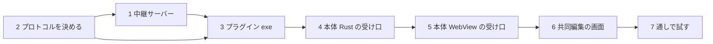

# 共同編集 段階 1 の実装計画

[collaboration.md](collaboration.md) の段階 1（2 人以上で同じ文を同時に書ける、自分たちで試すための版）の作業の分け方。仕様と用語はそちらと [GLOSSARY.md](../GLOSSARY.md) に従う。

## 段階 1 の範囲

入れるもの：中継サーバー、プラグインの骨組み、本体の受け口、エンドツーエンド暗号化、招待リンク、参加の承認、名前付きカーソル。

段階 1 では次のように簡単にしておき、後の段階で正式な形にする。

| 項目 | 段階 1 | 正式な形（段階） |
|------|-------|----------------|
| 名前 | 共同編集を始めるとき・参加するときに自分で入力する | 参加用の鍵に入った名前（2） |
| 中継サーバーへの接続 | 誰でも接続できる（URL を知っていれば） | 参加用の鍵で確かめる（2） |
| 参加のしかた | 招待リンクを「共同編集に参加」の欄に貼り付ける | 同じ（リンクのクリックでアプリを開くのは未定） |
| 画像 | 共有しない（参加者の画面では表示されない） | 両方向にやり取り（3） |
| 切断 | 切れたらセッションを終える | 数十秒は再接続を待つ（3） |
| 見るだけの参加者 | 無し（承認すれば全員編集できる） | 承認時に選べる（3） |

## 作業の順番

### 1. 中継サーバー（新規 `relay/`）✅

[relay/README.md](../relay/README.md)。テストは 20 件。

Cloudflare Worker + Durable Object（TypeScript）。

- `relay/wrangler.toml`、`relay/src/index.ts`、`relay/src/room.ts`
- `POST /rooms`：共同編集セッションを作り、セッション ID と**ホスト用の合言葉**を返す。ホストの接続を後から確かめるためのもの
- `GET /rooms/:id`（WebSocket）：1 セッションに 1 つの Durable Object へつなぐ
- Durable Object `Room`
  - Hibernation API（`state.acceptWebSocket`）を使う。接続ごとの状態（ホストか・承認済みか・名前・接続 ID）は `serializeAttachment` に持つ
  - 承認前の接続には暗号文を流さない。ホストへは「参加を求めています」だけを伝える
  - ホストから承認が届いたら、その接続を承認済みにする。以降は承認済みの接続どうしで、受け取った暗号文をそのまま流す（送り主には返さない）
  - ホストを含めて 10 人を超える接続は断る
  - ホストが切れたら、全員の接続を閉じる
- テスト：`@cloudflare/vitest-pool-workers` を使い、承認前に流れないこと、10 人で断ること、ホストが切れたら閉じることを確かめる

### 2. プロトコルを決める（新規 `docs/collaboration-protocol.md`）✅

[collaboration-protocol.md](collaboration-protocol.md) に書いた。以下は書く前の要点。

実装の前に、次の 2 か所のやり取りの形を文書にする。

- **プラグイン ⇔ 中継サーバー**
  - 文字のフレーム：制御用の JSON。参加の要求・承認・断り・参加者の一覧・退出
  - バイナリのフレーム：暗号文
  - 先頭にプロトコルの版を入れる
- **本体 Rust ⇔ プラグイン**：標準入出力で、1 行 1 つの JSON をやり取りする。バイナリは base64 にする
  - 本体からプラグインへ：`start`、`join`、`send`、`approve`、`leave`
  - プラグインから本体へ：`invite`、`join-request`、`joined`、`peers`、`data`、`closed`、`error`
- **招待リンク**：`https://<中継サーバー>/r/<セッション ID>#k=<鍵>`
  - 鍵は `#` の後ろ（フラグメント）に置く。ブラウザで開いてもサーバーへは送られない
  - ブラウザで開いたときは「Markdown Preview の『共同編集に参加』に貼り付けてください」と表示する

### 3. 共同編集プラグイン（新規 `collab-plugin/`、Rust）✅

[collab-plugin/README.md](../collab-plugin/README.md)。テストは単体 10 件と、中継サーバーを相手にした通し 4 件。TLS は rustls（ring）で、証明書は Windows の証明書ストアを使う（社内のプロキシが独自のルート証明書を使っていても通るように）。

画面を持たない exe（`markdown-preview-collab.exe`）。

- 使う crate：`tokio`、`tokio-tungstenite`（rustls）、`aes-gcm`、`rand`、`base64`、`serde_json`
- `start`：中継サーバーにセッションを作らせる。暗号の鍵（256 ビット）を作って招待リンクを返す
- `join`：招待リンクから中継サーバー・セッション ID・鍵を取り出して接続する
- `send` と `data`：AES-256-GCM で暗号化・復号する（ノンスは送るたびにランダム）。中身は解釈せず、本体から受け取ったバイト列をそのまま扱う
- 中継サーバーの URL は、プラグインの設定ファイル（`%APPDATA%` 配下）に置く。`ws://` は開発用に `localhost` だけ許す
- テスト（`cargo test`）
  - 暗号化して復号すると元に戻る
  - 別の鍵では復号に失敗する
  - 招待リンクを読み取れる

### 4. 本体 Rust の受け口（`src-tauri/src/collab.rs` を新規、`lib.rs` に登録）✅

テストは 5 件（本物のプラグインの exe を起動して確かめる。先に `collab-plugin` で `cargo build` しておく）。開発中は、環境変数 `MDPREVIEW_COLLAB_PLUGIN` に `collab-plugin\target\debug\markdown-preview-collab.exe` の絶対パス を入れると、そのプラグインを使う。

- `collab_available`：本体の exe と同じフォルダに `markdown-preview-collab.exe` があるかを返す
- `collab_call`：プロトコル②の依頼に `id` を振ってプラグインへ渡し、`ok` / `fail` を返す（[collaboration-protocol.md](collaboration-protocol.md) の ①）
  - 最初の呼び出しでプラグインを起動し、`hello` で版を確かめる。起動には `std::process::Command` を使い、`CREATE_NO_WINDOW` でコンソールを出さない
  - 標準入出力へ受け渡すだけで、中身は見ない
- プラグインからのイベントは、`"collab-event"` で WebView へ渡す
- プラグインは一度起動したら、アプリが終わるまで動かしておく（共同編集セッションが終わっても止めない）。アプリが終わると標準入力が閉じ、プラグインも自分で終わる。プラグインが落ちたら `closed`（`reason: "plugin-exit"`）を知らせ、次の依頼で起動し直す
- Tauri の shell プラグインは使わないので、capabilities（権限の設定）は変えない
- **開発用の切り替え**：環境変数 `MDPREVIEW_DEV_INSTANCE=<名前>` が設定されているときは、次の 2 つを行う。1 台の PC で、ホストと参加者を両方起動して試すため。リリース版でも害は無いが、README には書かない
  - single-instance プラグインを登録しない（2 つ目を起動できるようにする）
  - アプリのデータの置き場所を `%LOCALAPPDATA%\jp.asuzacgroup.markdownpreview\dev-instances\<名前>` に分ける（Tauri の `appDirectoriesOverride`。WebView2 のデータ＝localStorage もここに入る）

### 5. 本体 WebView の受け口 ✅

`src/collab/`（`transport.ts`・`session.ts`・`editor.ts`・`text.ts`）と `src/main.ts`。テストは `npm test`（偽の中継サーバーを使い 11 件）。計画から変えた・足した点：

- provider と session は分けず、`CollabSession` 1 つにまとめた（送る順番の保証と、溜まった変更をまとめる処理を含む）
- 共同編集を始められるのは、保存済みのファイルのタブだけ（ホストのファイルが正本のため）
- 本文の差し替え（再読み込み・外部での変更の取り込み）は、違う部分だけを Y.Text に流す（`applyText`）
- 参加者は、段階 1 では画像を貼り付けられない
- 共同編集のタブを閉じるときは、終える（ホスト）・抜ける（参加者）かを確かめる
- 画面から呼ぶ入り口は `startCollab(name)` と `joinCollab(invite, name)`。参加の承認は作業 6 で画面を作る

- 追加する npm パッケージ：`yjs`、`y-codemirror.next`、`y-protocols`
- `src/collab/provider.ts`：Yjs の同期のやり取り（sync step 1・2、update、awareness）を IPC 経由で流す
  - 中継サーバーは文書を持たない。そのため、新しく入った参加者には**ホストが**今の内容を送る
  - カーソルの送信（awareness）は間引く（例：100 ms に 1 回まで）
- `src/collab/session.ts`：Y.Doc を作る・捨てる
  - ホスト：始めた時点のタブの本文を Y.Text に入れる
  - 参加者：ホストから受け取った内容で始める
  - 元に戻すには `Y.UndoManager` を使い、自分の編集だけを戻す
- `src/editor.ts`：`createState` が追加の extension（共同編集用の `yCollab`）を受け取れるようにする
- `src/main.ts`
  - `Tab` に `collab?`（その共同編集セッションの状態）を持たせる
  - 共同編集中のタブがほかのタブの裏にある間も、Y.Text は更新され続ける。ところが CodeMirror の EditorState は退避したままなので、`activate()` で表に戻すときに Y.Text から EditorState を作り直す。元に戻す履歴は Y.UndoManager に残るので失われない
  - `textOf()`：共同編集中のタブでは Y.Text の内容を返す。ホストの保存と未保存の判定は今のまま使える
  - 参加者のタブ：`path` は持たず、タブ名は「ホストのファイル名（共同編集）」にする。Ctrl+S は「名前を付けて保存」と同じ動き（コピーとして保存）にする

### 6. 共同編集の画面 ✅

`src/collab/ui.ts`、`index.html`、`src/styles.css`。ホストと参加者のアプリを 2 つ起動し、WebView2 のデバッグポートで画面を操作する通しの確認 `scripts/collab-ui-e2e.mjs` で 16 項目を確かめた（始める → 参加 → 承認 → 両方向の編集 → 名前付きカーソル → 保存 → ホストが落ちたら参加者は読み取り専用）。参加者一覧と招待リンクは、ツールバーの「共同編集」で開く画面に出す。

- プラグインがあるときだけ、ツールバーまたはメニューに「共同編集」を出す。中身は次の 3 つ
  - 「このタブで共同編集を始める」
  - 「共同編集に参加」
  - 「共同編集を終える」
- 始めるとき：名前を入力する → 招待リンクを表示してコピーできるようにする
- 参加するとき：招待リンクを貼り付ける → 名前を入力する → ホストの承認を待つ
- ホストの画面
  - 「〇〇さんが参加を求めています」のお知らせに［承認］［断る］を出す
  - 参加者の一覧を出す
- 名前付きカーソル：`y-codemirror.next` の標準の表示を、本体のテーマ（明るい・暗い）に合わせる
- 設定ダイアログに、中継サーバーの URL の欄を追加する。保存先はプラグインの設定ファイル

### 7. 通しで試す

手順と記入用の表は [collaboration-stage1-trial.md](collaboration-stage1-trial.md)。2 台目の PC には、インストール不要の試験版（`out\collab-test.zip`）を使う。

- `wrangler dev` で中継サーバーを手元で動かす
- 2 台の PC で、次の流れを確かめる
  1. ホストが始める
  2. 参加者がリンクを貼って参加を求める
  3. ホストが承認する
  4. 2 人で同じ段落を同時に書く
  5. ホストが保存する
  6. 参加者がコピーとして保存する
  7. ホストが抜けると、参加者の画面が終わる
- Cloudflare の無料プランにデプロイして、在宅の回線と社内の回線の間でも同じことを確かめる
- 1 台の PC で試すときは、開発用の切り替え（作業 4）を使い、`MDPREVIEW_DEV_INSTANCE` を変えて 2 つ起動する
