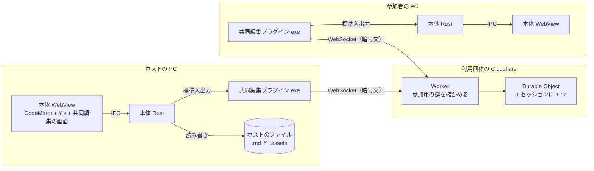

# 共同編集（設計）

拠点の違う人や在宅の人と、インターネット越しに 1 つの Markdown をリアルタイムで共同編集するための設計。必要な人だけが入れる**共同編集プラグイン**として提供し、入れていない本体は今までどおり外と通信しない。

用語は [GLOSSARY.md](../GLOSSARY.md) の「共同編集」節に従う。判断の理由は次の ADR に残している。

- [ADR 0003 共同編集の通信は本体に入れず、別の exe（共同編集プラグイン）に分ける](adr/0003-collaboration-plugin-as-separate-exe.md)
- [ADR 0004 中継サーバーは作者が運営せず、利用団体が自分の Cloudflare に置く](adr/0004-relay-on-each-organizations-own-cloudflare.md)

---

## 全体の構成

| 部品 | 受け持つこと | 持たないこと |
|------|------------|------------|
| 本体 WebView | Yjs の文書、CodeMirror との同期、共同編集の画面（開始・承認・参加者の一覧・カーソル・書き手の色分け） | 通信 |
| 本体 Rust | プラグインの起動と停止、WebView とプラグインの間の受け渡し、ファイルの読み書き（今と同じ） | 通信、暗号 |
| 共同編集プラグイン | 中継サーバーとの WebSocket、暗号化と復号、参加用の鍵の保管（資格情報マネージャー） | 画面、文書の中身の解釈 |
| 中継サーバー | 参加用の鍵の確認、承認された接続の間で暗号文を受け渡す | 復号、保存 |

- WebView の CSP（`connect-src` は IPC のみ）は緩めない
- プラグインが無い本体では、共同編集のメニューを表示しない

---

## 決まっている仕様

### 共同編集セッション

- 1 文字単位のリアルタイム共同編集。Yjs と CodeMirror 6 で作る
- 1 つのアプリで同時に開ける共同編集セッションは 1 つ。人数はホストを含めて最大 10 人
- ホストのファイルが正本。保存するのはホストだけで、Ctrl+S による手動保存のみ（自動保存はしない）
- 参加者は手元にファイルを持たない。タブ名は「ホストのファイル名（共同編集）」。参加者の Ctrl+S は「コピーとして保存」になる
- ホストはほかのタブに切り替えてもよく、その間も同期は続く

### 参加のしかた

1. 団体管理者が、ホストにも参加者にも参加用の鍵を配る
2. ホストが共同編集セッションを始め、招待リンクを参加者へ送る（チャットなど）
3. 参加者がリンクを開くと、中継サーバーが参加用の鍵の署名を確かめる
4. ホストの画面に「〇〇さんが参加を求めています」と出る。ホストは「編集できる」か「見るだけ」を選んで承認する
5. 承認されるまで、中継サーバーはその接続へ何も流さない

- 招待リンクには、そのセッションの暗号の鍵が入っている
- 見るだけの参加者は、アプリの中で編集を止める（悪意のある参加者は想定しない）

### 暗号化

- 変更はエンドツーエンドで暗号化する。中継サーバーは中身を読めず、何も保存しない
- 画像も同じ鍵で暗号化して送る

### 参加用の鍵

- 団体管理者が 1 人ずつ発行する。本人の名前が入っていて、カーソルと書き手の色分けにはこの名前を出す
- 署名用の秘密鍵は団体管理者の手元にだけ置き、中継サーバーは公開鍵で確かめる
- 期限は 1 年。無効にした鍵では、次の接続から入れなくなる（接続中は切らない）
- 発行と無効化は、団体管理者が実行するコマンド（管理ツール）で行う
- PC では Windows の資格情報マネージャーに保管する。中継サーバーの URL などの秘密でない設定は、プラグインの設定ファイルに置く

### 誰が書いたか

- 各人のカーソルと選択範囲を、名前付き・色付きで表示する
- 書き手の色分け：本文のどこを誰が書いたかを人ごとの色で示す。マウスを載せると名前を表示する
- セッション前からあった文には色を付けない。外部での変更を取り込んだ部分は、ホストが書いたものとして扱う
- ファイルには残さない（セッションが終われば消える）
- 削除の履歴（いつ誰が何を消したか）は追わない

### 編集の振る舞い

- 元に戻す（Ctrl+Z）では、自分の編集だけを戻す
- 共同編集中にホストのファイルが外部で書き換えられたら、今と同じバナーを出す。「取り込む」を選ぶと、差分をホストの編集として全員に流す

### 画像

- ホストの既存の画像（`.assets`、注釈の元画像）は、表示に必要になったときにホストから参加者へ送る
- 参加者が貼った画像はホストへ送る。ホストは今と同じく、保存時に `.assets` へ書く
- 1 枚 10 MB まで。超える画像は「大きすぎて共有できません」と表示する

### 切断

- 数十秒は再接続を待つ。ホストが戻れば続きから再開する
- ホストが戻らなければ、参加者の画面は読み取り専用になる。手元の最新の内容は「コピーとして保存」できる
- ホストの未保存分は、今と同じくホストのアプリに残る

### 配布と版

- 共同編集プラグインは、本体と同じ GitHub Releases で無料で公開する。本体のバージョンアップ機能で一緒に更新する
- 中継サーバー（Cloudflare Worker）のソースも同じリポジトリに置く。利用団体は「Deploy to Cloudflare」ボタンか `wrangler` で自分のアカウントへ置く
- 接続時にプロトコルの版を確かめる。合わなければ「ホストと版が違います」と表示する

### 費用

- 中継サーバーの費用は利用団体が持つ。作者は運営しない
- 開発と試験運用は Workers の無料プランで足りる。ただし 1 日の上限に達すると、翌日 9:00（日本時間）まで使えない
- 本格的に使う利用団体には、月 $5 の有料プランを勧める
- 待機中の課金を避けるため、Durable Object では WebSocket の Hibernation API を使う。カーソルの送信は間引く

---

## 作る順番

| 段階 | 入れるもの | できるようになること |
|------|-----------|-------------------|
| 1 | 中継サーバー、プラグインの骨組み、本体の受け口、エンドツーエンド暗号化、招待リンク、参加の承認、名前付きカーソル | 2 人以上で同じ文を同時に書ける（自分たちで試すための版） |
| 2 | 参加用の鍵と管理ツール、鍵の期限と無効化、資格情報マネージャーへの保管 | 利用団体が認めた人だけに絞れる（**本番利用はここから**） |
| 3 | 画像のやり取り、書き手の色分け、見るだけの参加者、再接続、外部変更の取り込み、プロトコルの版の確認 | この文書の仕様が全部そろう |

段階 1 のまま利用団体に配ることはしない。参加用の鍵が無いと、中継サーバーの URL を知っている人なら誰でも、その利用団体の費用で使えてしまうため。

段階 1 の作業の分け方は [collaboration-stage1-plan.md](collaboration-stage1-plan.md) にまとめた。
