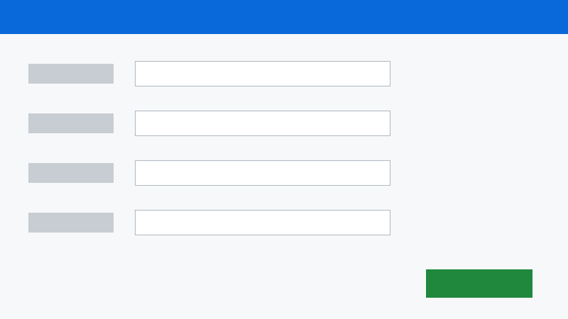

# 画像の注釈のサンプル

下の画像を右クリック →「注釈を編集…」で、矢印・テキスト・枠・番号を付けてみてください（適用すると `img/form.annotated.png` が書き出されます）。

| No. | 要望 |
|---|---|
| ① | 調理日は自動で今日の日付が入るようにしたい |
| ② | ハシは入力の流れ的に下の方に入力欄を移動したい |
| ③ | 注意点の登録が無い製品は、欄ごと表示されないようにしたい（登録があるときだけ出す） |
