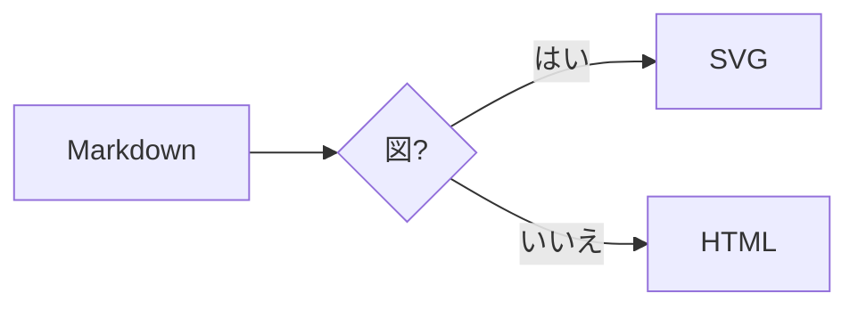
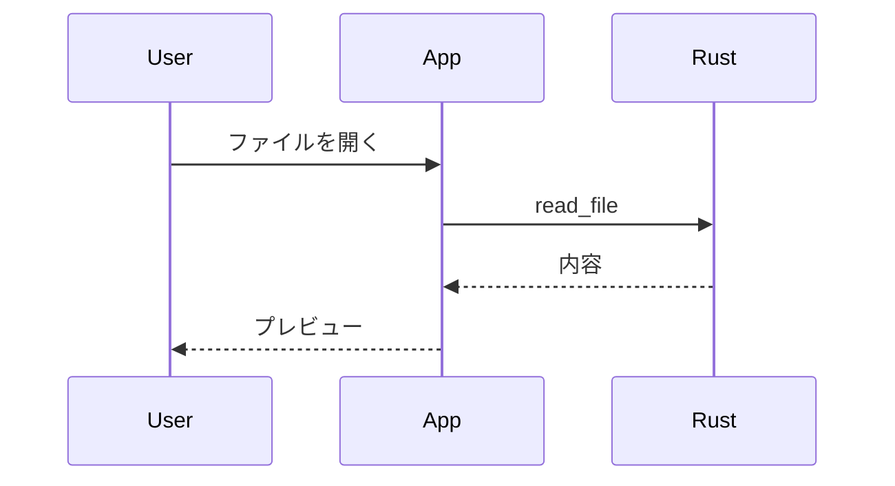
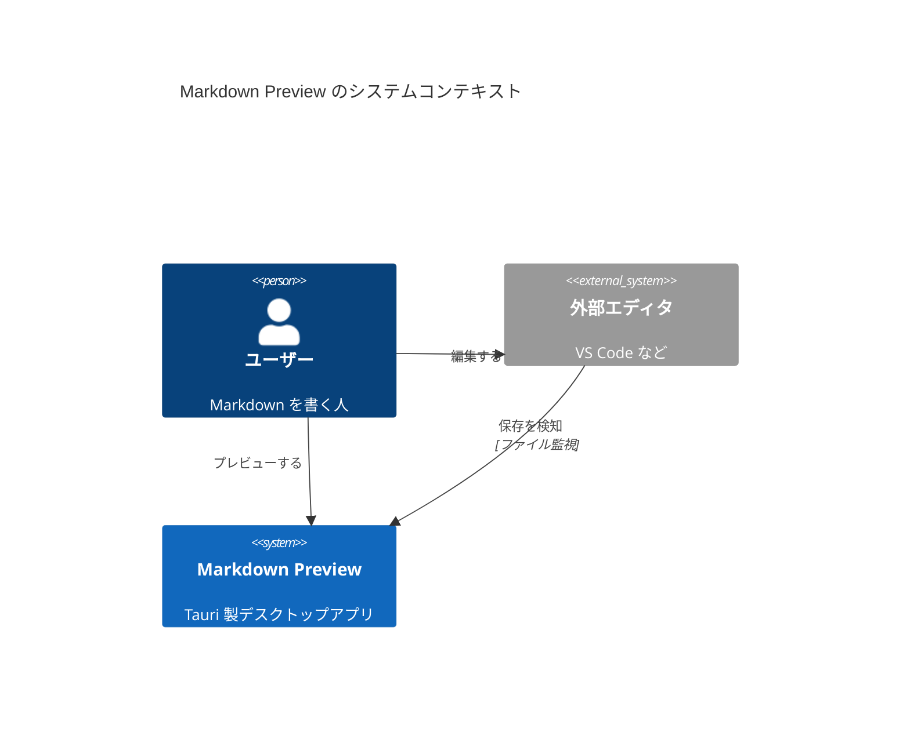

# Markdown Preview デモ


[目次へ](#表と装飾) ・ [外部リンク](https://github.com) ・ [別の Markdown](other.md)

## 表と装飾

| 機能 | 状態 | 備考 |
|---|:---:|---|
| **太字** / *斜体* / ~~取消~~ | ✅ | GFM |
| `インラインコード` | ✅ | |

- [x] タスクリスト
- [ ] 未完了のタスク

脚注の例です[^1]。

[^1]: これは脚注です。

## コードハイライト

```ts
export function greet(name: string): string {
  return `Hello, ${name}!`;
}
```

```rust
fn main() { println!("こんにちは"); }
```

## Mermaid フローチャート



## Mermaid シーケンス図



## C4 コンテキスト図（Mermaid）



## Graphviz


## WaveDrom

```wavedrom
{ signal: [
  { name: "clk",  wave: "p......" },
  { name: "data", wave: "x.345x.", data: ["a", "b", "c"] },
  { name: "req",  wave: "0.1..0." },
]}
```

## エラーになる図

```mermaid
flowchart LR
  A -->
```
