# Markdown 基本 {#markdown}

## 使用技術・書き方の調べ方
[markdown-it](https://github.com/markdown-it/markdown-it) 15（CommonMark 準拠）で HTML に変換している。表・取り消し線に加え、脚注（markdown-it-footnote）とタスクリスト（markdown-it-task-lists）に対応。コードブロックの色分けは [highlight.js](https://highlightjs.org/) 11。
- 基本の書き方: [CommonMark のヘルプ](https://commonmark.org/help/)
- 表など GitHub 風の書き方: [GitHub Flavored Markdown](https://github.github.com/gfm/)
- 色分けできる言語名: [highlight.js の対応言語](https://highlightjs.readthedocs.io/en/latest/supported-languages.html)

## 見出し
行頭に `#` を 1〜6 個。`#` の後ろには半角スペースが必要。
~~~~example
# 見出し1
## 見出し2
### 見出し3
~~~~

## 段落と改行
空行で段落を分ける。段落内で改行したいときは行末に半角スペース 2 つか `<br>`。
~~~~example
1 行目と同じ段落
（ここは前の行とつながる）

新しい段落。行末にスペース2つで  
改行される。
~~~~

## 強調・取り消し線
~~~~example
**太字** / *斜体* / ***太字斜体*** / ~~取り消し~~ / `インラインコード`
~~~~

## 箇条書き
`-` `*` `+` のどれでもよい。半角スペース 2〜4 個で字下げすると入れ子になる。
~~~~example
- りんご
- みかん
  - 温州みかん
  - 伊予柑
- ぶどう
~~~~

## 番号付きリスト
番号は全部 `1.` でも自動で連番になる。
~~~~example
1. 準備する
1. 実行する
   1. テスト
   1. 本番
1. 片付ける
~~~~

## タスクリスト
~~~~example
- [x] 設計
- [x] 実装
- [ ] レビュー
~~~~

## リンク
見出しへのリンクは `#見出しの文字`（空白は `-`、記号は除く）。相対パスの `.md` はアプリ内で開く。
~~~~example
[外部サイト](https://example.com)
[同じ文書の見出しへ](#見出し1)
[別の Markdown](./other.md)
<https://example.com>
~~~~

## 画像
相対パスは md ファイルの場所が基準。エディタで Ctrl+V するとクリップボードの画像を `assets/` に保存して挿入できる。
~~~~example


ふつうは `` のようにファイルを指定する。サイズを指定したいときは HTML で ``。
~~~~

## 引用
~~~~example
> 引用文です。
> 複数行も書ける。
>> 入れ子の引用
~~~~

## コードブロック
``` の後ろに言語名を書くと色分けされる（ts, js, python, rust, go, java, c, cpp, cs, sql, json, yaml, bash, powershell, html, css など）。
~~~~example
```python
def hello(name: str) -> str:
    return f"Hello, {name}!"
```
~~~~

## 表
2 行目の `:` の位置で寄せを指定する（`:---` 左 / `:---:` 中央 / `---:` 右）。
~~~~example
| 項目 | 数量 | 単価 |
|:-----|:----:|-----:|
| りんご | 3 | 120 |
| みかん | 10 | 40 |
~~~~

## 水平線
~~~~example
上の文章

---

下の文章
~~~~

## 脚注
~~~~example
本文に脚注を付ける[^memo]。

[^memo]: 脚注の内容はページの最後に表示される。
~~~~

## 折りたたみ（HTML）
一部の HTML タグはそのまま使える（スクリプトなど危険なものは除去される）。
~~~~example
<details>
<summary>クリックで開く</summary>

中身には **Markdown** も書ける。

</details>
~~~~

## エスケープ
記号をそのまま表示したいときは前に `\` を付ける。
~~~~example
\*アスタリスク\* \# シャープ \[角かっこ\]
~~~~

# Mermaid {#mermaid}

## 使用技術・書き方の調べ方
```` ```mermaid ```` で囲んだ部分を [Mermaid](https://mermaid.js.org/) 12 で描画している（アプリに同梱。オフラインで動く）。
- 図の種類ごとの書き方: [Mermaid の構文リファレンス](https://mermaid.js.org/intro/syntax-reference.html)
- ブラウザで書いて試す: [Mermaid Live Editor](https://mermaid.live/)（外部サイトに図の内容が送られるので、社外秘の図は貼らない）

## フローチャートの基本
```` ```mermaid ```` で囲む。向きは `TD`（上→下）/ `LR`（左→右）/ `BT` / `RL`。
~~~~example
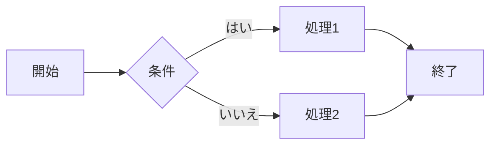
```mermaid
flowchart LR
  A[開始] --> B{条件}
  B -- はい --> C[処理1]
  B -- いいえ --> D[処理2]
  C --> E[終了]
  D --> E
```
~~~~

## ノードの形
~~~~example

```mermaid
flowchart LR
  a[四角] --- b(角丸) --- c([スタジアム]) --- d[[サブルーチン]]
  e[(データベース)] --- f((円)) --- g{ひし形} --- h{{六角形}}
  i[/平行四辺形/] --- j[\逆平行四辺形\] --- k[/台形\] --- l>旗]
```
~~~~

## 矢印の種類
~~~~example
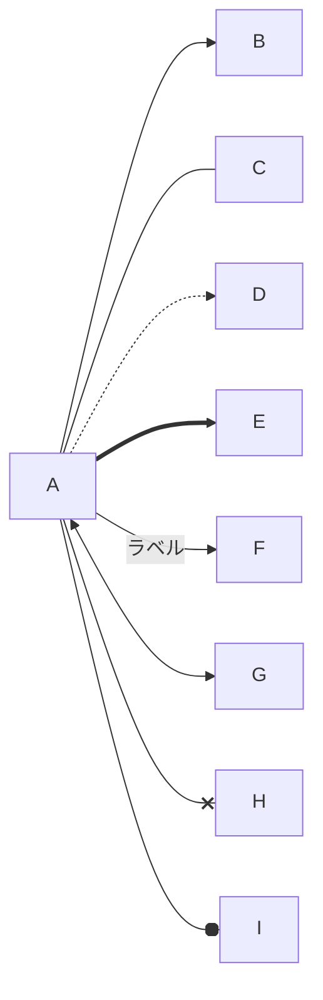
```mermaid
flowchart LR
  A --> B
  A --- C
  A -.-> D
  A ==> E
  A -->|ラベル| F
  A <--> G
  A --x H
  A --o I
```
~~~~

## サブグラフ
~~~~example
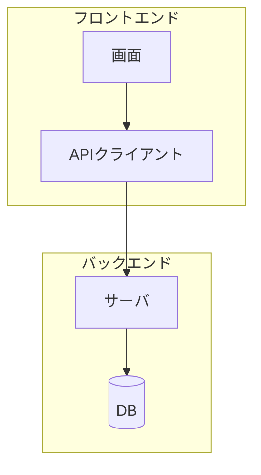
```mermaid
flowchart TB
  subgraph フロントエンド
    UI[画面] --> API[APIクライアント]
  end
  subgraph バックエンド
    S[サーバ] --> DB[(DB)]
  end
  API --> S
```
~~~~

## スタイル・クラス
~~~~example
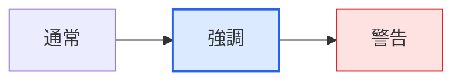
```mermaid
flowchart LR
  A[通常] --> B[強調] --> C[警告]
  classDef em fill:#dbeafe,stroke:#2563eb,stroke-width:2px
  classDef warn fill:#fee2e2,stroke:#dc2626
  class B em
  class C warn
```
~~~~

## シーケンス図
`->>` 実線矢印、`-->>` 点線矢印、`activate` で実行中を表す。
~~~~example
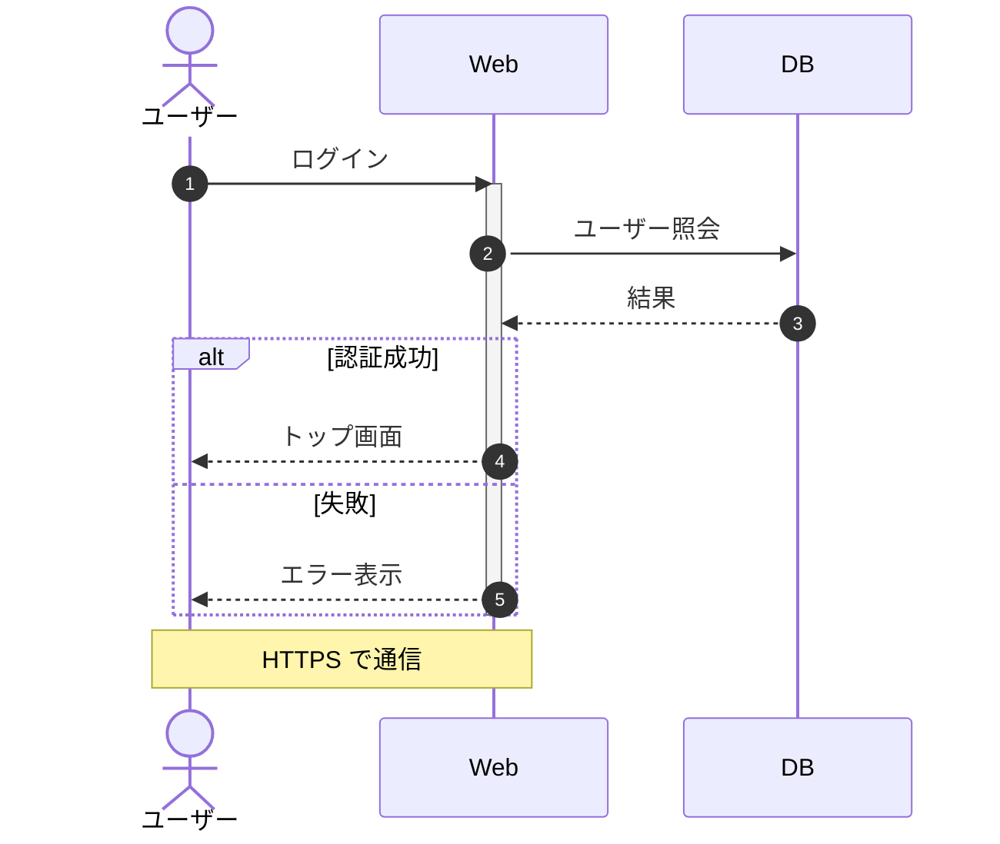
```mermaid
sequenceDiagram
  autonumber
  actor U as ユーザー
  participant W as Web
  participant D as DB
  U->>W: ログイン
  activate W
  W->>D: ユーザー照会
  D-->>W: 結果
  alt 認証成功
    W-->>U: トップ画面
  else 失敗
    W-->>U: エラー表示
  end
  deactivate W
  Note over U,W: HTTPS で通信
```
~~~~

## クラス図
~~~~example
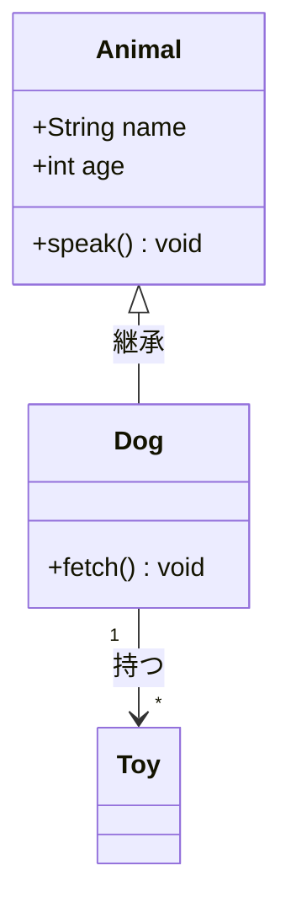
```mermaid
classDiagram
  class Animal {
    +String name
    +int age
    +speak() void
  }
  class Dog {
    +fetch() void
  }
  Animal <|-- Dog : 継承
  Dog "1" --> "*" Toy : 持つ
```
~~~~

## 状態遷移図
~~~~example
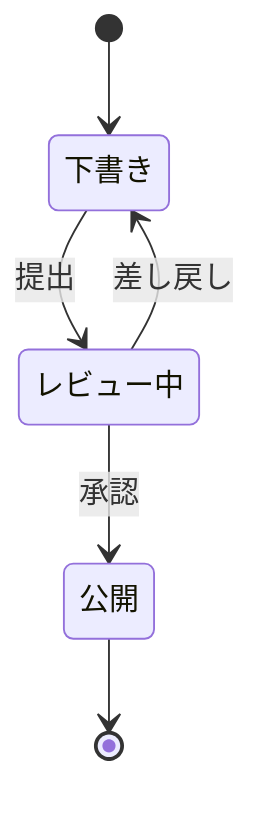
```mermaid
stateDiagram-v2
  [*] --> 下書き
  下書き --> レビュー中 : 提出
  レビュー中 --> 下書き : 差し戻し
  レビュー中 --> 公開 : 承認
  公開 --> [*]
```
~~~~

## ER 図
`||--o{` は「1 対 0 以上」。`|o` 0か1、`||` ちょうど1、`}o` 0以上、`}|` 1以上。
~~~~example
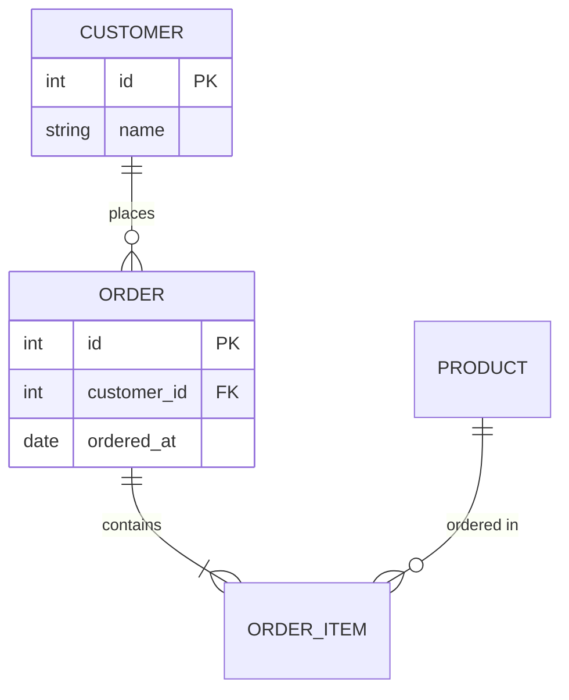
```mermaid
erDiagram
  CUSTOMER ||--o{ ORDER : places
  ORDER ||--|{ ORDER_ITEM : contains
  PRODUCT ||--o{ ORDER_ITEM : "ordered in"
  CUSTOMER {
    int id PK
    string name
  }
  ORDER {
    int id PK
    int customer_id FK
    date ordered_at
  }
```
~~~~

## ガントチャート
~~~~example

```mermaid
gantt
  title 開発スケジュール
  dateFormat YYYY-MM-DD
  axisFormat %m/%d
  section 設計
    要件定義     :done, a1, 2026-10-01, 5d
    基本設計     :active, a2, after a1, 7d
  section 実装
    実装         :b1, after a2, 10d
    テスト       :b2, after b1, 5d
  section リリース
    リリース     :milestone, after b2, 0d
```
~~~~

## 円グラフ
~~~~example
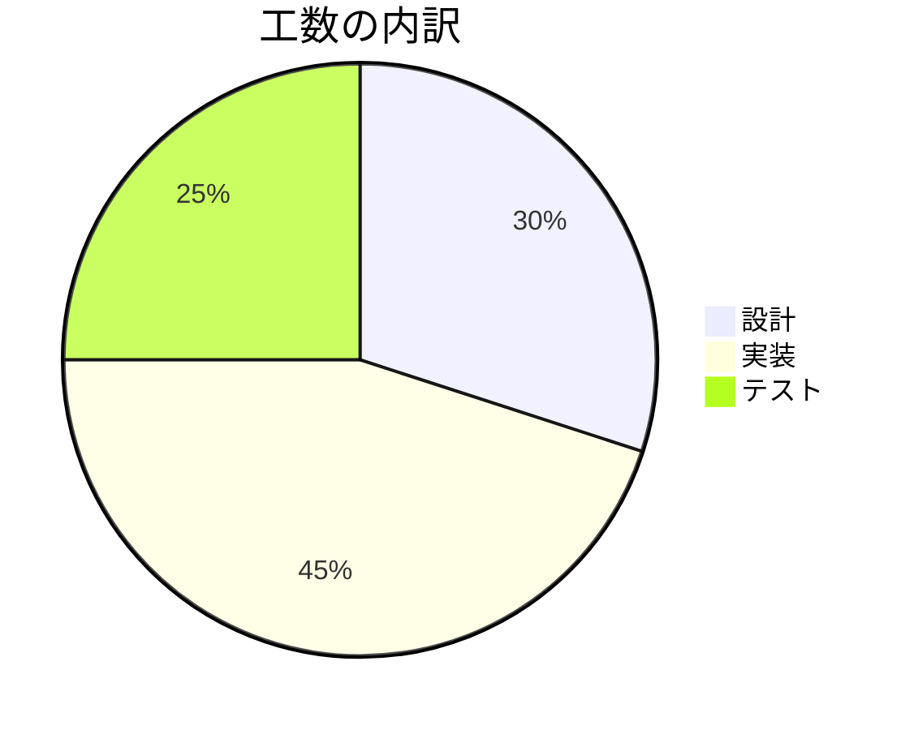
```mermaid
pie title 工数の内訳
  "設計" : 30
  "実装" : 45
  "テスト" : 25
```
~~~~

## マインドマップ
字下げの深さで階層を表す。
~~~~example
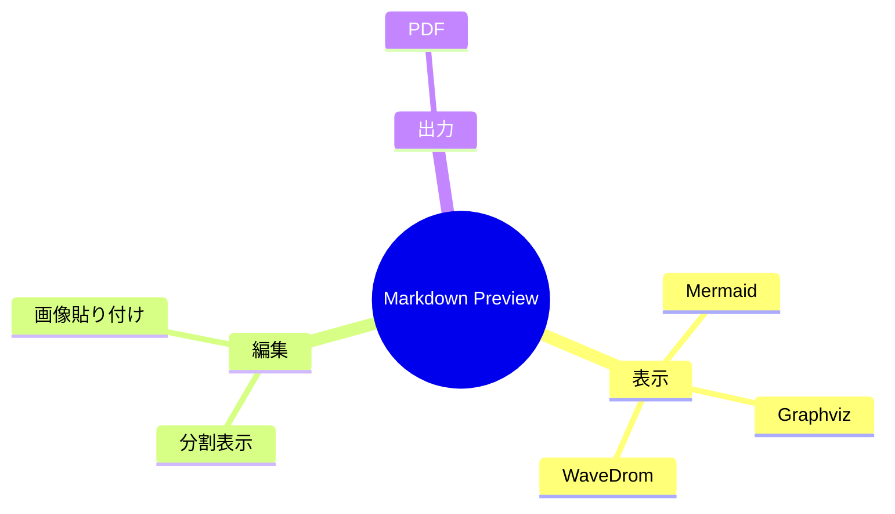
```mermaid
mindmap
  root((Markdown Preview))
    表示
      Mermaid
      Graphviz
      WaveDrom
    編集
      分割表示
      画像貼り付け
    出力
      PDF
```
~~~~

## タイムライン
~~~~example
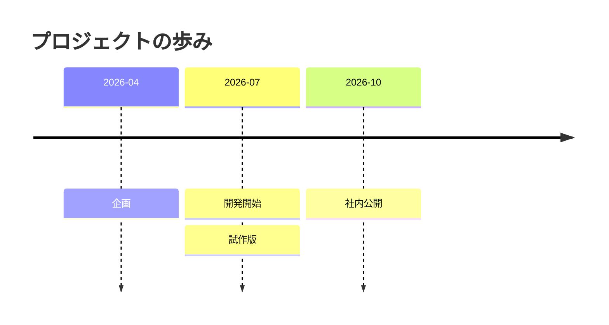
```mermaid
timeline
  title プロジェクトの歩み
  2026-04 : 企画
  2026-07 : 開発開始 : 試作版
  2026-10 : 社内公開
```
~~~~

## Git グラフ
~~~~example
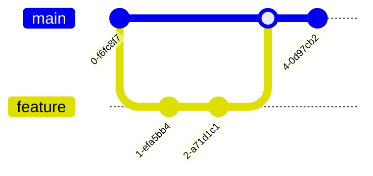
```mermaid
gitGraph
  commit
  branch feature
  checkout feature
  commit
  commit
  checkout main
  merge feature
  commit
```
~~~~

## ユーザージャーニー
数字は満足度（1〜5）。
~~~~example
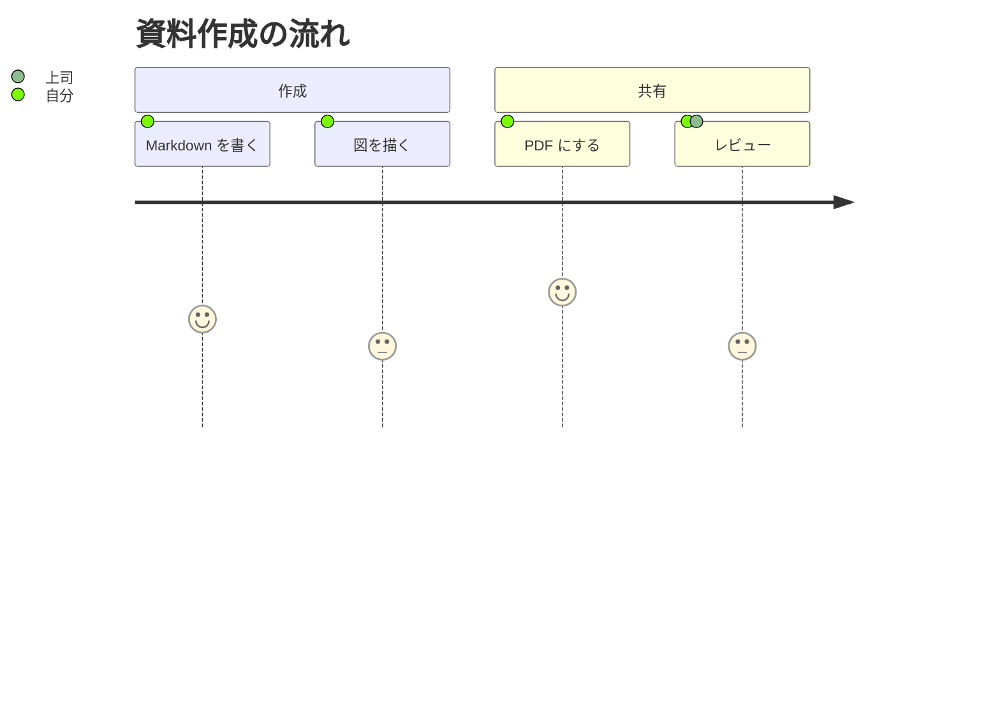
```mermaid
journey
  title 資料作成の流れ
  section 作成
    Markdown を書く: 4: 自分
    図を描く: 3: 自分
  section 共有
    PDF にする: 5: 自分
    レビュー: 3: 自分, 上司
```
~~~~

## 4象限チャート
~~~~example
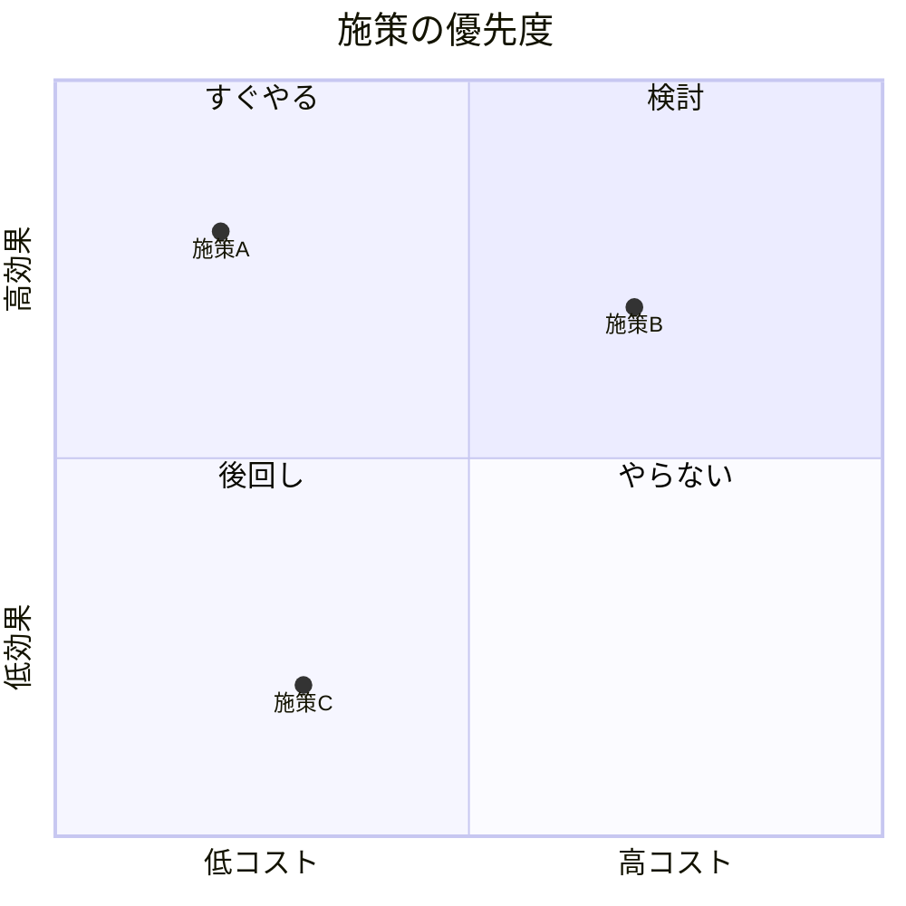
```mermaid
quadrantChart
  title 施策の優先度
  x-axis 低コスト --> 高コスト
  y-axis 低効果 --> 高効果
  quadrant-1 検討
  quadrant-2 すぐやる
  quadrant-3 後回し
  quadrant-4 やらない
  施策A: [0.2, 0.8]
  施策B: [0.7, 0.7]
  施策C: [0.3, 0.2]
```
~~~~

# C4 モデル（Mermaid） {#c4}

## 使用技術・書き方の調べ方
Mermaid 12 の C4 図（```` ```mermaid ```` の中で `C4Context` などから書き始める）。
- 書き方: [Mermaid の C4 図](https://mermaid.js.org/syntax/c4.html)（Mermaid 側でも試験的な機能という扱い）
- C4 モデルの考え方: [c4model.com](https://c4model.com/)
- Mermaid の C4 は線の経路や配置を指定できない。線を箱に重ねたくないときは [C4 モデル（Graphviz）](#c4-graphviz) を使う

## システムコンテキスト図
`Person` 利用者、`System` 対象システム、`System_Ext` 外部システム、`Rel(元, 先, "説明", "技術")` 関係。
~~~~example
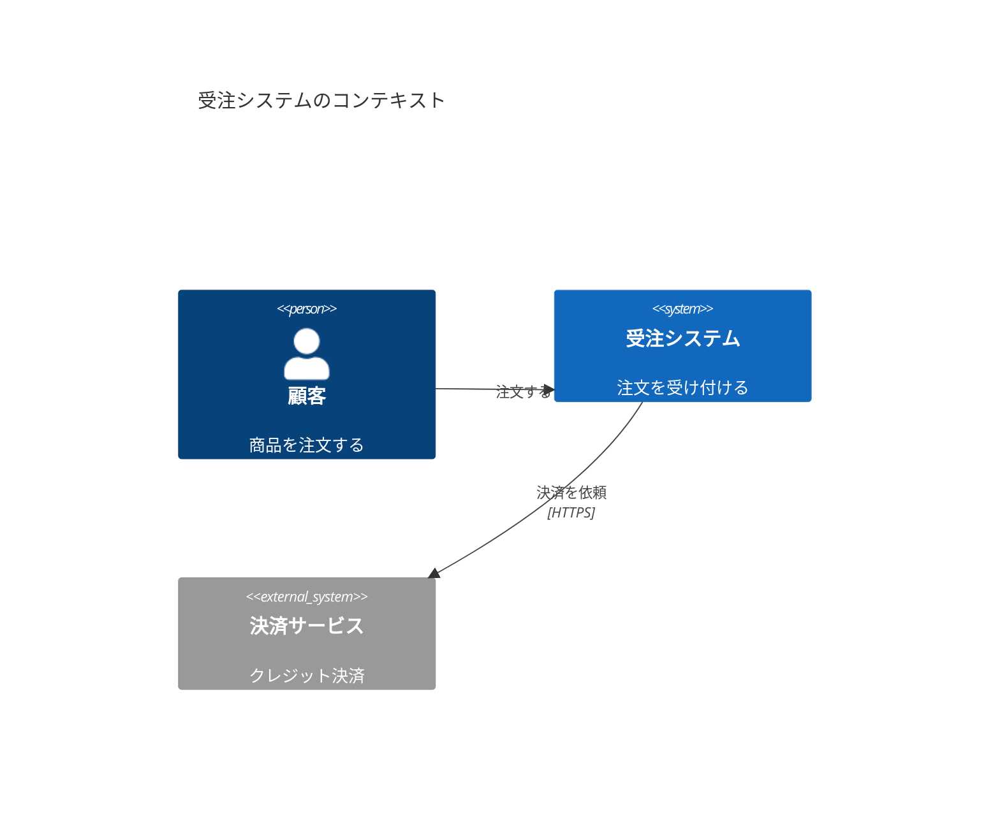
```mermaid
C4Context
  title 受注システムのコンテキスト
  Person(customer, "顧客", "商品を注文する")
  System(shop, "受注システム", "注文を受け付ける")
  System_Ext(pay, "決済サービス", "クレジット決済")
  Rel(customer, shop, "注文する")
  Rel(shop, pay, "決済を依頼", "HTTPS")
```
~~~~

## コンテナ図
`System_Boundary` で囲み、`Container` / `ContainerDb` でアプリやDBを表す。
~~~~example
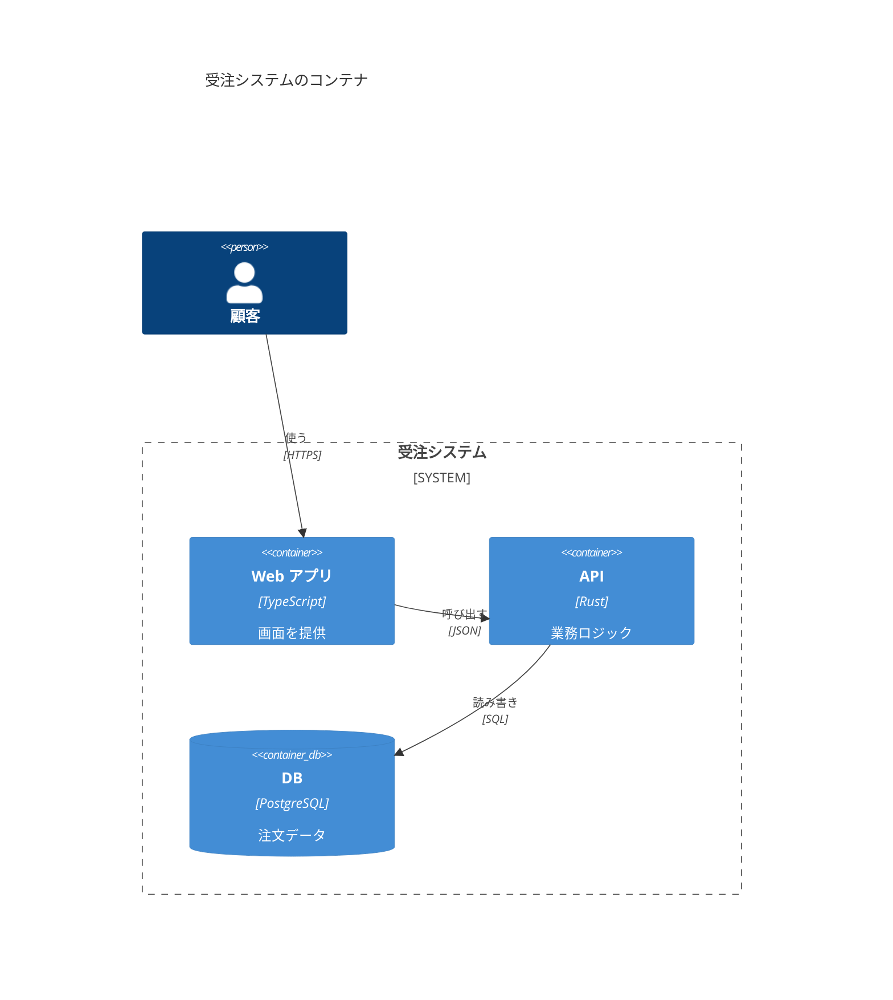
```mermaid
C4Container
  title 受注システムのコンテナ
  Person(customer, "顧客")
  System_Boundary(b, "受注システム") {
    Container(web, "Web アプリ", "TypeScript", "画面を提供")
    Container(api, "API", "Rust", "業務ロジック")
    ContainerDb(db, "DB", "PostgreSQL", "注文データ")
  }
  Rel(customer, web, "使う", "HTTPS")
  Rel(web, api, "呼び出す", "JSON")
  Rel(api, db, "読み書き", "SQL")
```
~~~~

## コンポーネント図
~~~~example
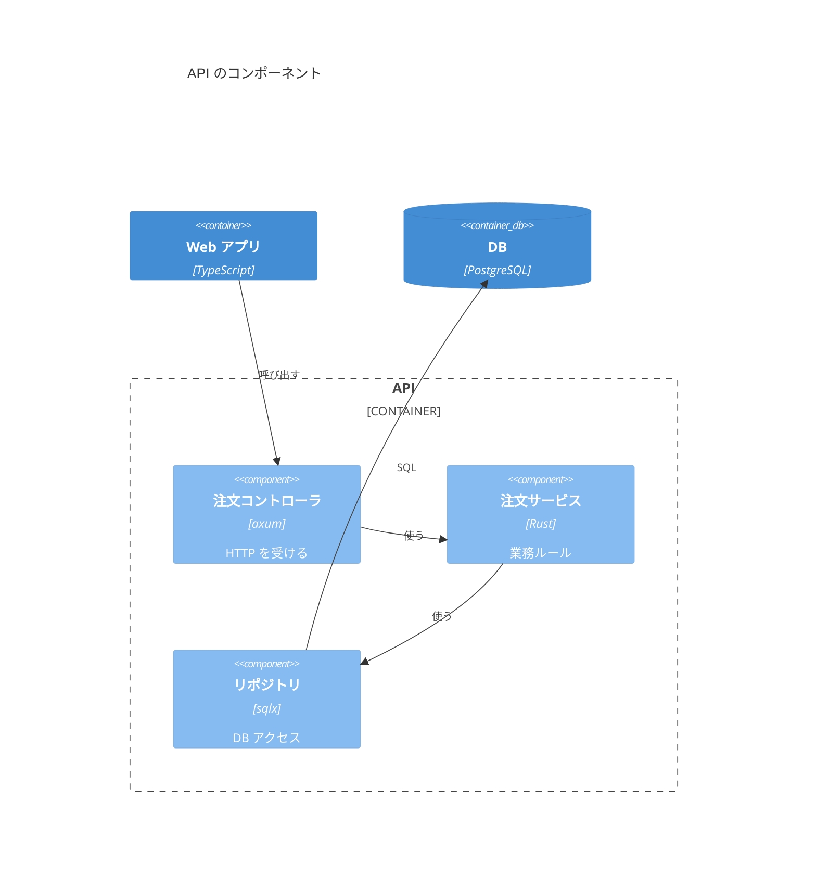
```mermaid
C4Component
  title API のコンポーネント
  Container(web, "Web アプリ", "TypeScript")
  Container_Boundary(api, "API") {
    Component(ctrl, "注文コントローラ", "axum", "HTTP を受ける")
    Component(svc, "注文サービス", "Rust", "業務ルール")
    Component(repo, "リポジトリ", "sqlx", "DB アクセス")
  }
  ContainerDb(db, "DB", "PostgreSQL")
  Rel(web, ctrl, "呼び出す")
  Rel(ctrl, svc, "使う")
  Rel(svc, repo, "使う")
  Rel(repo, db, "SQL")
```
~~~~

## 線の重なり・余白を調整する
Mermaid の C4 は自動レイアウトしない。要素は書いた順に横へ並ぶので、`UpdateLayoutConfig` で 1 行の個数を変え、`UpdateRelStyle` でラベル位置をずらす。
~~~~example
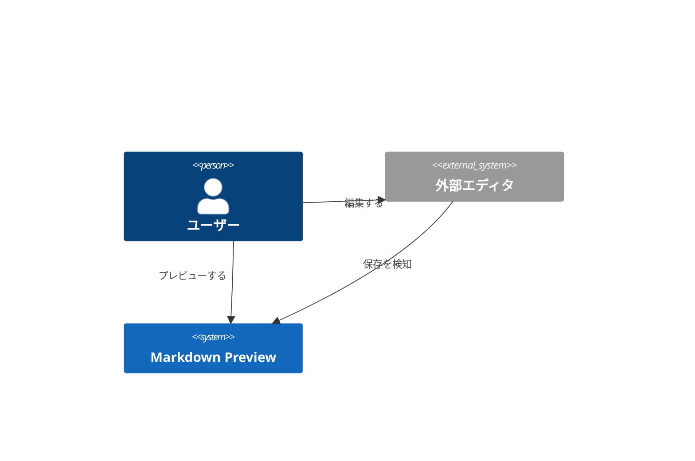
```mermaid
C4Context
  Person(user, "ユーザー")
  System_Ext(editor, "外部エディタ")
  System(app, "Markdown Preview")
  Rel(user, editor, "編集する")
  Rel(user, app, "プレビューする")
  Rel(editor, app, "保存を検知")
  UpdateRelStyle(user, app, $offsetX="-90", $offsetY="-10")
  UpdateLayoutConfig($c4ShapeInRow="2", $c4BoundaryInRow="1")
```
~~~~

## 要素の色を変える
~~~~example
```mermaid
C4Context
  System(a, "通常のシステム")
  System(b, "注目するシステム")
  UpdateElementStyle(b, $bgColor="#d1242f", $borderColor="#82071e")
  Rel(a, b, "連携")
```
~~~~

# Graphviz {#graphviz}

## 使用技術・書き方の調べ方
```` ```dot ```` / ```` ```graphviz ```` で囲んだ部分を [Graphviz](https://graphviz.org/) で描画している。Graphviz を WebAssembly にした [@viz-js/viz](https://github.com/mdaines/viz-js) 3 をアプリに同梱しているので、オフラインで動く。
- 書き方（DOT 言語）: [DOT Language](https://graphviz.org/doc/info/lang.html)
- 色・線・間隔などの属性: [Attributes](https://graphviz.org/doc/info/attrs.html)
- ノードの形: [Node Shapes](https://graphviz.org/doc/info/shapes.html)
- 作例: [Gallery](https://graphviz.org/gallery/)

## 有向グラフの基本
```` ```dot ```` または ```` ```graphviz ```` で囲む。`rankdir=LR` で左→右。
~~~~example
```dot
digraph G {
  rankdir=LR;
  開始 -> 処理 -> 終了;
  処理 -> エラー [label="失敗", color=red];
}
```
~~~~

## ノードの形と装飾
~~~~example
```dot
digraph G {
  node [fontname="sans-serif"];
  a [shape=box, style="rounded,filled", fillcolor="#dbeafe", label="角丸"];
  b [shape=ellipse, label="楕円"];
  c [shape=diamond, label="判定"];
  d [shape=cylinder, label="DB"];
  e [shape=note, label="メモ"];
  a -> b -> c -> d;
  c -> e [style=dashed];
}
```
~~~~

## クラスタ（グループ）
サブグラフ名を `cluster_` で始めると枠で囲まれる。
~~~~example
```dot
digraph G {
  compound=true;
  subgraph cluster_front { label="フロント"; style=rounded; ui; router; }
  subgraph cluster_back  { label="バック"; style=rounded; api; db [shape=cylinder]; }
  ui -> router -> api -> db;
}
```
~~~~

## 無向グラフ
~~~~example
```dot
graph G {
  layout=circo;
  A -- B -- C -- D -- A;
  A -- C;
}
```
~~~~

## レコード（表形式のノード）
~~~~example
```dot
digraph G {
  node [shape=record];
  user [label="{users|id: int\lname: text\l}"];
  order [label="{orders|id: int\luser_id: int\l}"];
  order -> user [label="user_id"];
}
```
~~~~

# C4 モデル（Graphviz） {#c4-graphviz}

## 使用技術・書き方の調べ方
```` ```c4 ```` で囲むと、C4-PlantUML / Mermaid と同じ書き方の C4 図を、このアプリが Graphviz の DOT に変換して描く。Mermaid の C4 と違い、線は箱を避けて通り、`Rel_R` や `Lay_D` で配置を指定できる。Mermaid の C4 のソースは、```` ```mermaid ```` を ```` ```c4 ```` に変えるだけで描ける（`UpdateRelStyle` / `UpdateLayoutConfig` は無視される）。
- 書き方の元: [C4-PlantUML](https://github.com/plantuml-stdlib/C4-PlantUML)（このアプリが対応しているのは下の一覧だけ）
- C4 モデルの考え方: [c4model.com](https://c4model.com/)
- `dot:` で指定する属性: [Graphviz の属性一覧](https://graphviz.org/doc/info/attrs.html)
- 要素: `Person` `Person_Ext` `System` `System_Ext` `SystemDb` `SystemDb_Ext` `Container` `Container_Ext` `ContainerDb` `ContainerDb_Ext` `Component` `Component_Ext` `ComponentDb` `ComponentDb_Ext`
- 囲み: `Boundary` `System_Boundary` `Container_Boundary` `Enterprise_Boundary`（`{` `}` で囲む。入れ子可）
- 関係: `Rel` `Rel_D` `Rel_U` `Rel_R` `Rel_L` `BiRel`（`BiRel_D` なども可）
- 配置だけ: `Lay_D` `Lay_U` `Lay_R` `Lay_L`
- 全体: `title` `LAYOUT_TOP_DOWN()` `LAYOUT_LEFT_RIGHT()` `UpdateElementStyle` `dot:`
- 文字列の中の `\n` で改行できる。要素の説明は長いと自動で折り返す
- `Person` / `Person_Ext` は人のアイコン付きの箱になる

## コンテキスト図
`Person(id, "名前", "説明")`、`System(id, "名前", "説明")`、`Rel(元, 先, "説明", "技術")`。
~~~~example
```c4
title 受注システムのコンテキスト
Person(customer, "顧客", "商品を注文する")
System(shop, "受注システム", "注文を受け付けて在庫を引き当てる")
System_Ext(pay, "決済サービス", "クレジット決済")
Rel(customer, shop, "注文する")
Rel(shop, pay, "決済を依頼", "HTTPS")
```
~~~~

## コンテナ図（囲み）
`System_Boundary(id, "名前") { … }` で囲む。`Container(id, "名前", "技術", "説明")`、`ContainerDb` は円柱になる。
~~~~example
```c4
title 受注システムのコンテナ
Person(customer, "顧客")
System_Boundary(b, "受注システム") {
  Container(web, "Web アプリ", "TypeScript", "画面を提供")
  Container(api, "API", "Rust", "業務ロジック")
  ContainerDb(db, "DB", "PostgreSQL", "注文データ")
}
Rel(customer, web, "使う", "HTTPS")
Rel(web, api, "呼び出す", "JSON")
Rel(api, db, "読み書き", "SQL")
```
~~~~

## 配置を決める（Rel_R / Lay_D）
`Rel_R(a, b)` は b を a の右に、`Rel_L` は左、`Rel_U` は上、`Rel_D` は下に置く。`Lay_*` は線を引かずに位置だけ決める。囲み（Boundary）の id を `Rel` に書くと、線は枠で止まる。
~~~~example
```c4
Person(user, "利用者")
Container_Boundary(mon, "稼働モニタ") {
  Container(spa, "SPA", "TypeScript")
  Container(api, "API", "Rust")
}
System_Ext(mail, "メール")
Rel(user, spa, "見る")
Rel_R(spa, api, "呼ぶ")
Rel_R(api, mail, "通知")
Lay_D(user, mon)
```
~~~~

## 線の交差を減らすコツ
線が交差するのは、ひとつの要素から「囲みの中（DB・ファイル）」と「外部システム」の両方へ線が出ていて、相手が同じ段に並ぶとき。次の順に試す。
- 囲みの中の相手への線を `Rel_U` にして上の段へ、外部システムへの線は `Rel` のまま下の段へ分ける（矢印の向きは変わらず、置く場所だけが上になる）
- 複数の要素から線が集まる相手（共通の DB など）は、線を出す要素たちの真上か真下に来るよう `Rel_U` / `Rel_D` をそろえる
- 横に並べたい相手は `Rel_R` / `Rel_L`、線を引かずに位置だけ決めたいときは `Lay_*` を使う
- それでも詰まって見えるときは `dot: nodesep=1.0` / `dot: ranksep=1.0` で間隔を広げる
下の例は、DB への 2 本を `Rel_U` にしたもの。`Rel` に戻すと DB と外部システムが同じ段に並び、線が交差する。
~~~~example
```c4
Container_Boundary(sv, "サーバ") {
  Container(web, "Web", "Django")
  Container(batch, "バッチ", "cron")
  ContainerDb(db, "DB", "PostgreSQL")
}
System_Ext(sql, "SQL Server")
System_Ext(plc, "設備PLC")
System_Ext(mail, "SMTP")
Rel_U(web, db, "読み書き")
Rel_U(batch, db, "書き込み")
Rel(web, sql, "読み書き")
Rel(batch, sql, "読む")
Rel(batch, plc, "読み出し")
Rel(batch, mail, "通知")
```
~~~~

## 横向きにする
`LAYOUT_LEFT_RIGHT()` で左→右に並べる（このとき `Rel_D` / `Rel_U` が同じ列での上下になる）。
~~~~example
```c4
LAYOUT_LEFT_RIGHT()
Person(u, "ユーザー")
System(app, "アプリ", "1行目\n2行目")
SystemDb_Ext(db, "外部DB")
Rel(u, app, "使う")
Rel(app, db, "保存")
```
~~~~

## 線を直角にする・間隔を広げる（dot:）
`dot:` の後ろは DOT の文としてそのまま入る。`splines=ortho` で直角の線、`nodesep` / `ranksep` で横・縦の間隔（インチ）。直角の線ではラベルが線から離れたり消えたりすることがあるので、ラベルが多い図は `splines=polyline`（折れ線）が見やすい。
~~~~example
```c4
dot: splines=ortho
dot: nodesep=1.0
Container(gw, "Gateway", "nginx")
Container(a, "注文", "Go")
Container(b, "在庫", "Go")
Container(c, "配送", "Go")
Rel(gw, a)
Rel(gw, b)
Rel(gw, c)
```
~~~~

## 要素の色を変える
~~~~example
```c4
System(a, "通常のシステム")
System(b, "注目するシステム")
UpdateElementStyle(b, $bgColor="#d1242f", $borderColor="#82071e")
Rel_R(a, b, "連携")
```
~~~~

# WaveDrom {#wavedrom}

## 使用技術・書き方の調べ方
```` ```wavedrom ```` で囲んだ部分を [WaveDrom](https://wavedrom.com/) 3 で描画している。中身は JSON だが、このアプリでは JSON5（キーの引用符省略・末尾のカンマ・コメント可）で書ける。
- 書き方: [WaveDrom Tutorial](https://wavedrom.com/tutorial.html)

## 信号の基本
```` ```wavedrom ```` で囲み JSON（JSON5）で書く。1文字が1周期。
`p` クロック、`0` `1` レベル、`x` 不定、`=` `2`〜`9` データ（色違い）、`.` 直前を継続、`|` 省略。
~~~~example
```wavedrom
{ signal: [
  { name: "clk",  wave: "p......." },
  { name: "rst",  wave: "10......" },
  { name: "data", wave: "x.=.=.x.", data: ["A", "B"] },
  { name: "valid", wave: "0.1...0." }
]}
```
~~~~

## グループと区切り
配列で囲むとグループになる。`{}` は空行。
~~~~example
```wavedrom
{ signal: [
  { name: "clk", wave: "p....." },
  {},
  ["送信",
    { name: "tx",  wave: "x345x.", data: ["a", "b", "c"] },
    { name: "req", wave: "01..0." }
  ],
  ["受信",
    { name: "ack", wave: "0.1..0" }
  ]
]}
```
~~~~

## 矢印（エッジ）
`node` に付けた文字同士を `edge` でつなぐ。
~~~~example
```wavedrom
{ signal: [
  { name: "req", wave: "01..0.", node: ".a..." },
  { name: "ack", wave: "0.1..0", node: "..b.." }
],
  edge: ["a~>b 応答"]
}
```
~~~~

## レジスタ図
~~~~example
```wavedrom
{ reg: [
  { bits: 7, name: "opcode", attr: "OP" },
  { bits: 5, name: "rd" },
  { bits: 3, name: "funct3" },
  { bits: 5, name: "rs1" },
  { bits: 12, name: "imm" }
]}
```
~~~~

# このアプリの使い方 {#app}

## キーボードショートカット
~~~~example
| キー | 動作 |
|---|---|
| Ctrl+N / Ctrl+O | 新規 / 開く |
| Ctrl+S / Ctrl+Shift+S | 保存 / 名前を付けて保存 |
| Ctrl+P | PDF プレビュー（確認してから「保存」） |
| Ctrl+1 / 2 / 3 | 編集 / 分割 / プレビュー（編集から切り替えると編集位置を表示・色付け。分割表示ではカーソルのある箇所を常に色付け。色はツールバーの「設定」で変更） |
| Ctrl+ホイール | マウスの下のペインを拡大縮小 |
| Ctrl+＋ / Ctrl+− / Ctrl+0 | 拡大 / 縮小 / 100% |
| Ctrl+F（エディタ） | 検索・置換 |
| Tab / Shift+Tab（エディタ） | タブ文字を入力（範囲選択中は字下げ） / 字下げを戻す |
| Ctrl+, | 設定（テーマ・編集位置の色付け・更新） |
| F1 | このヘルプ |
| ツールバーの ◐ / ☀ / ☾ | テーマ（自動 / ライト / ダーク）を切り替え |
| F5 | ファイルを再読み込み |
~~~~

## 画像の貼り付け
~~~~example
1. スクリーンショットなどをクリップボードにコピー
2. エディタ（編集 / 分割モード）で **Ctrl+V**
3. `` が挿入される
4. **Ctrl+S** で保存すると、md と同じフォルダの `assets/` に画像が書き出される
~~~~

## PDF に出力する
~~~~example
1. ツールバーの **PDF** か **Ctrl+P** でプレビューを表示
2. 内容を確認して **保存…**（Ctrl+S）で保存先を選ぶ
3. 紙に印刷したいときはプレビュー右上の印刷ボタン

ダークモードで表示していても、PDF は白地で出力される。
~~~~

## バージョンアップ
~~~~example
- 起動時に GitHub の最新リリースを確認し、新しいバージョンがあれば画面上部にお知らせが出る
- **更新して再起動** で、ダウンロード・インストール・再起動まで自動で行われる
- 手動で確認するときは、ツールバーの **設定**（Ctrl+,）の **更新を確認**
- 自動確認は **設定** の「起動時に自動で更新を確認」で止められる（オフラインのときは何も表示されない）
~~~~

## 外部エディタとの併用
~~~~example
- VS Code などで md を編集・保存すると、プレビューが自動で更新される
- このアプリでも編集中（未保存）のときは、上部のバナーで「再読み込み / 無視」を選べる
- `.md` ファイルをウィンドウにドラッグ＆ドロップしても開ける
~~~~
