# Markdown 基本 {#markdown}

## 見出し
行頭に `#` を 1〜6 個。`#` の後ろには半角スペースが必要。
~~~~example
# 見出し1
## 見出し2
### 見出し3
~~~~

## 段落と改行
空行で段落を分ける。段落内で改行したいときは行末に半角スペース 2 つか `<br>`。
~~~~example
1 行目と同じ段落
（ここは前の行とつながる）

新しい段落。行末にスペース2つで  
改行される。
~~~~

## 強調・取り消し線
~~~~example
**太字** / *斜体* / ***太字斜体*** / ~~取り消し~~ / `インラインコード`
~~~~

## 箇条書き
`-` `*` `+` のどれでもよい。半角スペース 2〜4 個で字下げすると入れ子になる。
~~~~example
- りんご
- みかん
  - 温州みかん
  - 伊予柑
- ぶどう
~~~~

## 番号付きリスト
番号は全部 `1.` でも自動で連番になる。
~~~~example
1. 準備する
1. 実行する
   1. テスト
   1. 本番
1. 片付ける
~~~~

## タスクリスト
~~~~example
- [x] 設計
- [x] 実装
- [ ] レビュー
~~~~

## リンク
見出しへのリンクは `#見出しの文字`（空白は `-`、記号は除く）。相対パスの `.md` はアプリ内で開く。
~~~~example
[外部サイト](https://example.com)
[同じ文書の見出しへ](#見出し1)
[別の Markdown](./other.md)
<https://example.com>
~~~~

## 画像
相対パスは md ファイルの場所が基準。エディタで Ctrl+V するとクリップボードの画像を `assets/` に保存して挿入できる。
~~~~example


ふつうは `` のようにファイルを指定する。サイズを指定したいときは HTML で ``。
~~~~

## 引用
~~~~example
> 引用文です。
> 複数行も書ける。
>> 入れ子の引用
~~~~

## コードブロック
``` の後ろに言語名を書くと色分けされる（ts, js, python, rust, go, java, c, cpp, cs, sql, json, yaml, bash, powershell, html, css など）。
~~~~example
```python
def hello(name: str) -> str:
    return f"Hello, {name}!"
```
~~~~

## 表
2 行目の `:` の位置で寄せを指定する（`:---` 左 / `:---:` 中央 / `---:` 右）。
~~~~example
| 項目 | 数量 | 単価 |
|:-----|:----:|-----:|
| りんご | 3 | 120 |
| みかん | 10 | 40 |
~~~~

## 水平線
~~~~example
上の文章

---

下の文章
~~~~

## 脚注
~~~~example
本文に脚注を付ける[^memo]。

[^memo]: 脚注の内容はページの最後に表示される。
~~~~

## 折りたたみ（HTML）
一部の HTML タグはそのまま使える（スクリプトなど危険なものは除去される）。
~~~~example
<details>
<summary>クリックで開く</summary>

中身には **Markdown** も書ける。

</details>
~~~~

## エスケープ
記号をそのまま表示したいときは前に `\` を付ける。
~~~~example
\*アスタリスク\* \# シャープ \[角かっこ\]
~~~~

# Mermaid {#mermaid}

## フローチャートの基本
```` ```mermaid ```` で囲む。向きは `TD`（上→下）/ `LR`（左→右）/ `BT` / `RL`。
~~~~example
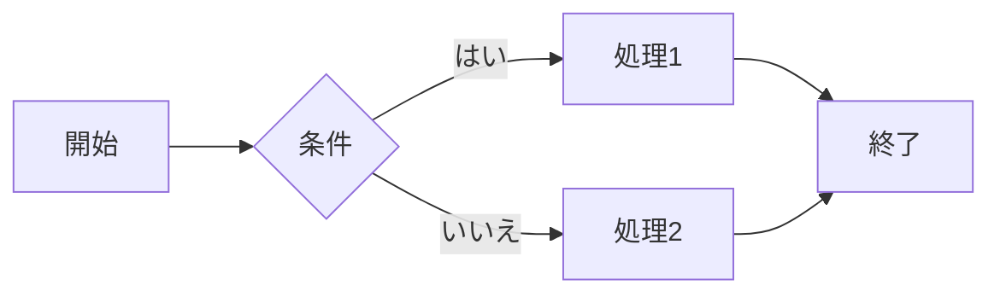
```mermaid
flowchart LR
  A[開始] --> B{条件}
  B -- はい --> C[処理1]
  B -- いいえ --> D[処理2]
  C --> E[終了]
  D --> E
```
~~~~

## ノードの形
~~~~example
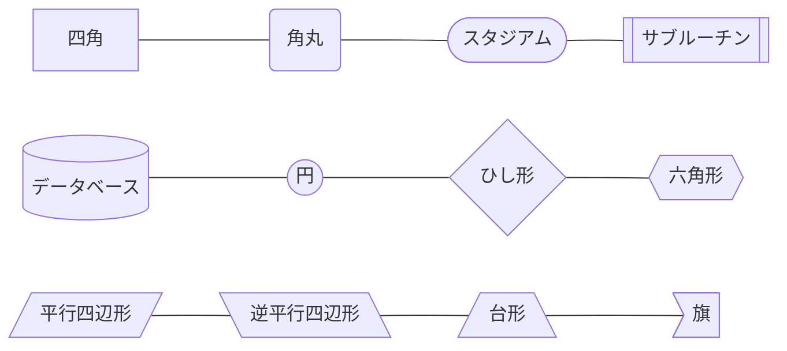
```mermaid
flowchart LR
  a[四角] --- b(角丸) --- c([スタジアム]) --- d[[サブルーチン]]
  e[(データベース)] --- f((円)) --- g{ひし形} --- h{{六角形}}
  i[/平行四辺形/] --- j[\逆平行四辺形\] --- k[/台形\] --- l>旗]
```
~~~~

## 矢印の種類
~~~~example
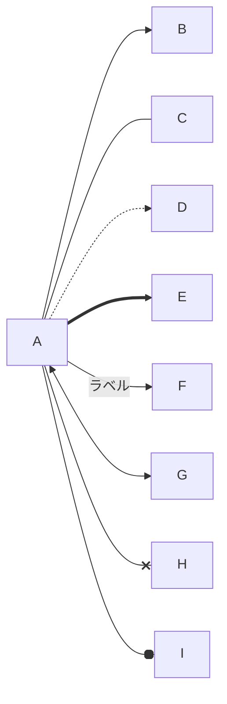
```mermaid
flowchart LR
  A --> B
  A --- C
  A -.-> D
  A ==> E
  A -->|ラベル| F
  A <--> G
  A --x H
  A --o I
```
~~~~

## サブグラフ
~~~~example
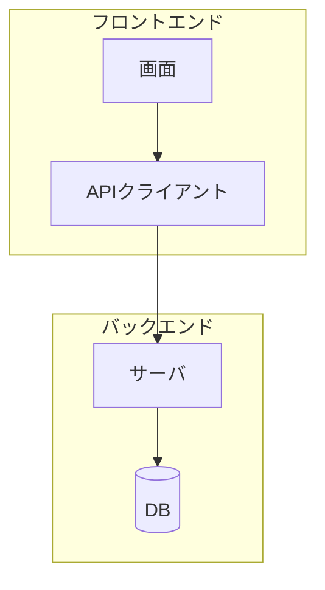
```mermaid
flowchart TB
  subgraph フロントエンド
    UI[画面] --> API[APIクライアント]
  end
  subgraph バックエンド
    S[サーバ] --> DB[(DB)]
  end
  API --> S
```
~~~~

## スタイル・クラス
~~~~example
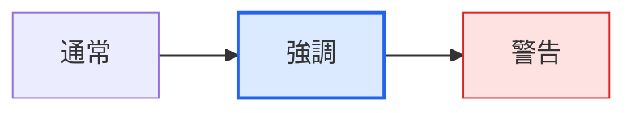
```mermaid
flowchart LR
  A[通常] --> B[強調] --> C[警告]
  classDef em fill:#dbeafe,stroke:#2563eb,stroke-width:2px
  classDef warn fill:#fee2e2,stroke:#dc2626
  class B em
  class C warn
```
~~~~

## シーケンス図
`->>` 実線矢印、`-->>` 点線矢印、`activate` で実行中を表す。
~~~~example
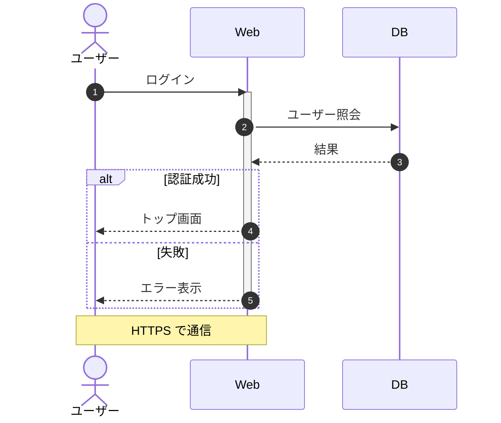
```mermaid
sequenceDiagram
  autonumber
  actor U as ユーザー
  participant W as Web
  participant D as DB
  U->>W: ログイン
  activate W
  W->>D: ユーザー照会
  D-->>W: 結果
  alt 認証成功
    W-->>U: トップ画面
  else 失敗
    W-->>U: エラー表示
  end
  deactivate W
  Note over U,W: HTTPS で通信
```
~~~~

## クラス図
~~~~example
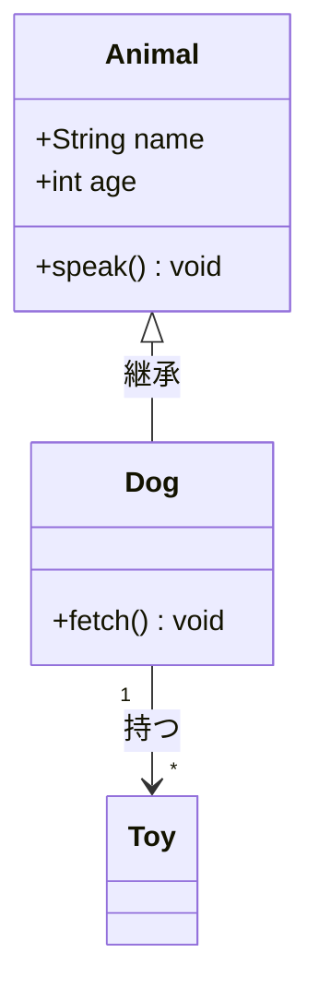
```mermaid
classDiagram
  class Animal {
    +String name
    +int age
    +speak() void
  }
  class Dog {
    +fetch() void
  }
  Animal <|-- Dog : 継承
  Dog "1" --> "*" Toy : 持つ
```
~~~~

## 状態遷移図
~~~~example
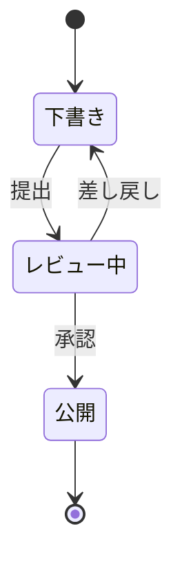
```mermaid
stateDiagram-v2
  [*] --> 下書き
  下書き --> レビュー中 : 提出
  レビュー中 --> 下書き : 差し戻し
  レビュー中 --> 公開 : 承認
  公開 --> [*]
```
~~~~

## ER 図
`||--o{` は「1 対 0 以上」。`|o` 0か1、`||` ちょうど1、`}o` 0以上、`}|` 1以上。
~~~~example
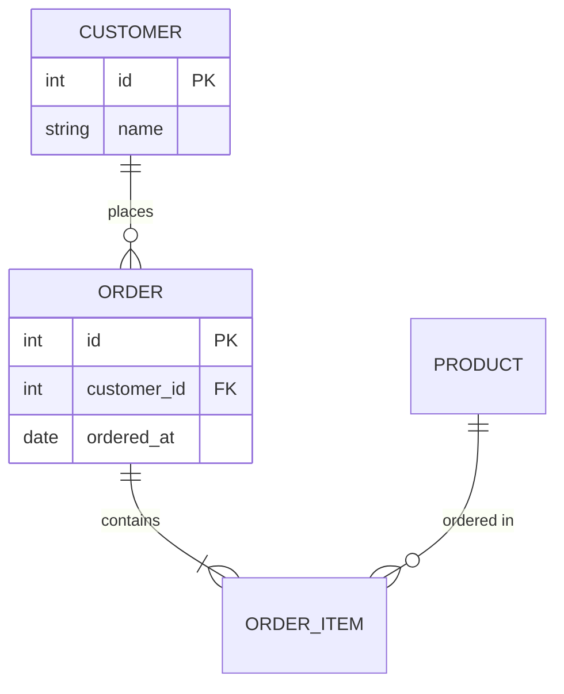
```mermaid
erDiagram
  CUSTOMER ||--o{ ORDER : places
  ORDER ||--|{ ORDER_ITEM : contains
  PRODUCT ||--o{ ORDER_ITEM : "ordered in"
  CUSTOMER {
    int id PK
    string name
  }
  ORDER {
    int id PK
    int customer_id FK
    date ordered_at
  }
```
~~~~

## ガントチャート
~~~~example
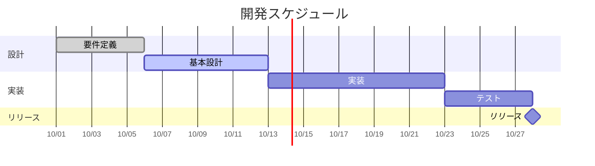
```mermaid
gantt
  title 開発スケジュール
  dateFormat YYYY-MM-DD
  axisFormat %m/%d
  section 設計
    要件定義     :done, a1, 2026-10-01, 5d
    基本設計     :active, a2, after a1, 7d
  section 実装
    実装         :b1, after a2, 10d
    テスト       :b2, after b1, 5d
  section リリース
    リリース     :milestone, after b2, 0d
```
~~~~

## 円グラフ
~~~~example
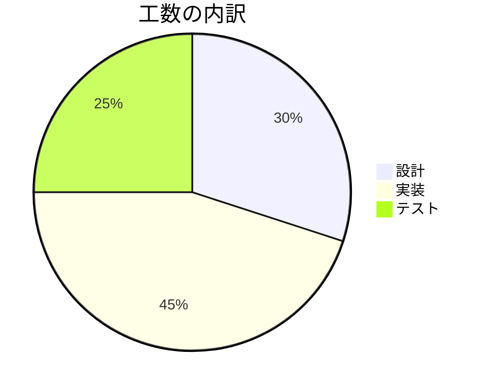
```mermaid
pie title 工数の内訳
  "設計" : 30
  "実装" : 45
  "テスト" : 25
```
~~~~

## マインドマップ
字下げの深さで階層を表す。
~~~~example
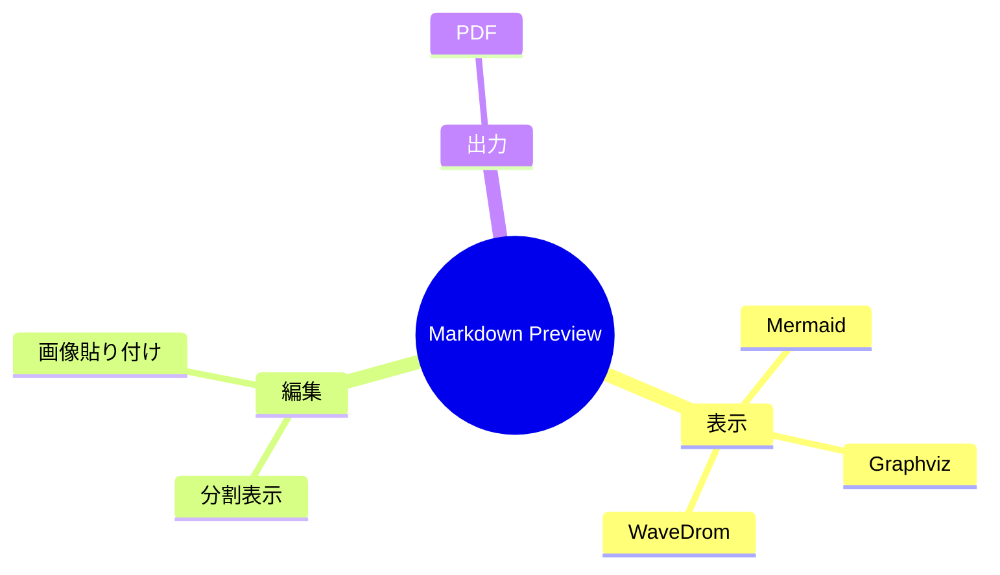
```mermaid
mindmap
  root((Markdown Preview))
    表示
      Mermaid
      Graphviz
      WaveDrom
    編集
      分割表示
      画像貼り付け
    出力
      PDF
```
~~~~

## タイムライン
~~~~example
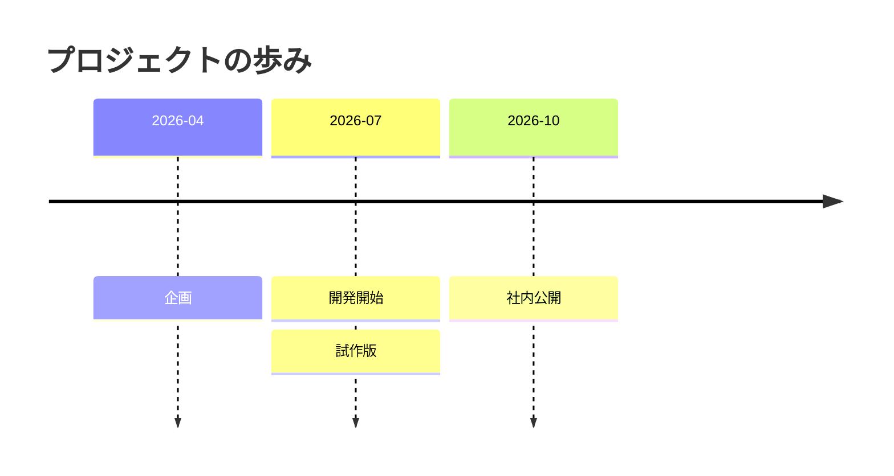
```mermaid
timeline
  title プロジェクトの歩み
  2026-04 : 企画
  2026-07 : 開発開始 : 試作版
  2026-10 : 社内公開
```
~~~~

## Git グラフ
~~~~example

```mermaid
gitGraph
  commit
  branch feature
  checkout feature
  commit
  commit
  checkout main
  merge feature
  commit
```
~~~~

## ユーザージャーニー
数字は満足度（1〜5）。
~~~~example
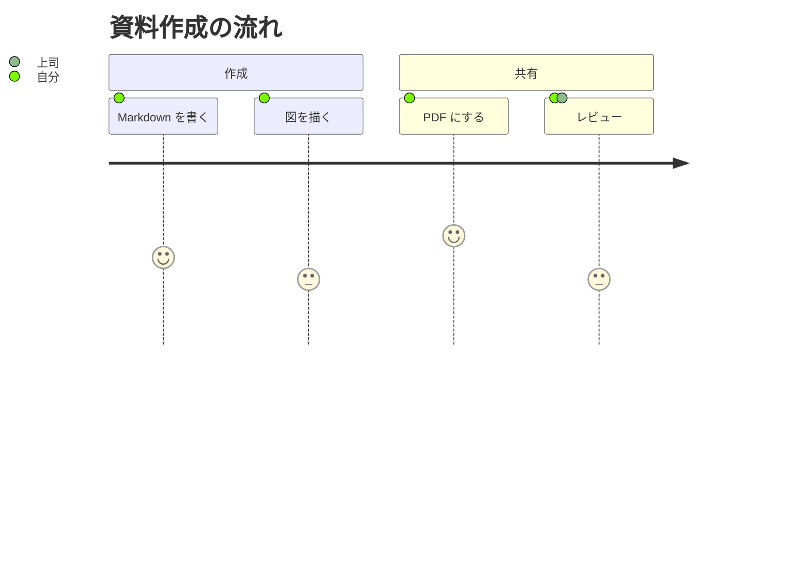
```mermaid
journey
  title 資料作成の流れ
  section 作成
    Markdown を書く: 4: 自分
    図を描く: 3: 自分
  section 共有
    PDF にする: 5: 自分
    レビュー: 3: 自分, 上司
```
~~~~

## 4象限チャート
~~~~example
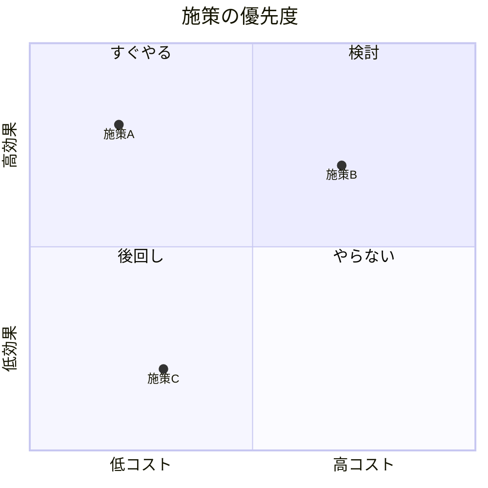
```mermaid
quadrantChart
  title 施策の優先度
  x-axis 低コスト --> 高コスト
  y-axis 低効果 --> 高効果
  quadrant-1 検討
  quadrant-2 すぐやる
  quadrant-3 後回し
  quadrant-4 やらない
  施策A: [0.2, 0.8]
  施策B: [0.7, 0.7]
  施策C: [0.3, 0.2]
```
~~~~

# C4 モデル（Mermaid） {#c4}

## システムコンテキスト図
`Person` 利用者、`System` 対象システム、`System_Ext` 外部システム、`Rel(元, 先, "説明", "技術")` 関係。
~~~~example
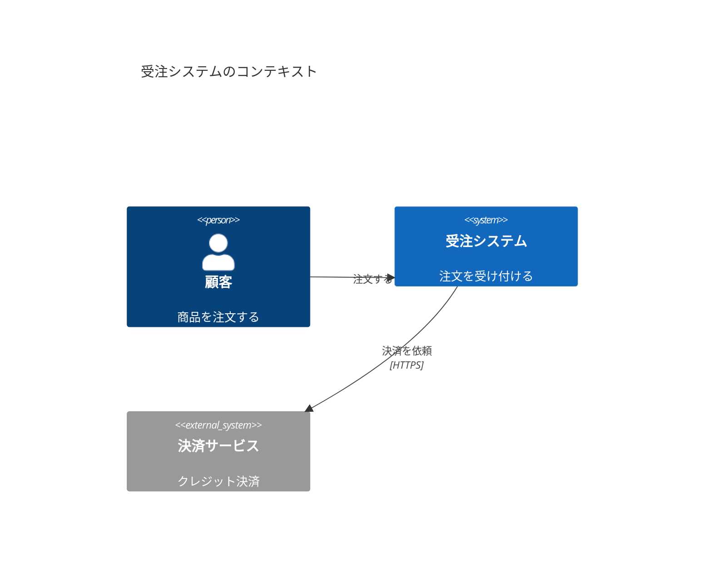
```mermaid
C4Context
  title 受注システムのコンテキスト
  Person(customer, "顧客", "商品を注文する")
  System(shop, "受注システム", "注文を受け付ける")
  System_Ext(pay, "決済サービス", "クレジット決済")
  Rel(customer, shop, "注文する")
  Rel(shop, pay, "決済を依頼", "HTTPS")
```
~~~~

## コンテナ図
`System_Boundary` で囲み、`Container` / `ContainerDb` でアプリやDBを表す。
~~~~example
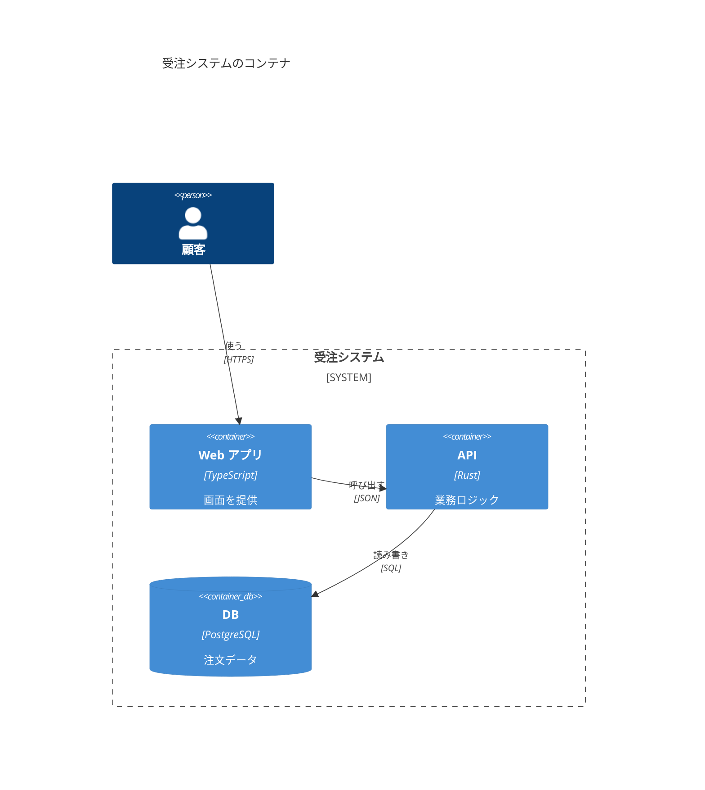
```mermaid
C4Container
  title 受注システムのコンテナ
  Person(customer, "顧客")
  System_Boundary(b, "受注システム") {
    Container(web, "Web アプリ", "TypeScript", "画面を提供")
    Container(api, "API", "Rust", "業務ロジック")
    ContainerDb(db, "DB", "PostgreSQL", "注文データ")
  }
  Rel(customer, web, "使う", "HTTPS")
  Rel(web, api, "呼び出す", "JSON")
  Rel(api, db, "読み書き", "SQL")
```
~~~~

## コンポーネント図
~~~~example
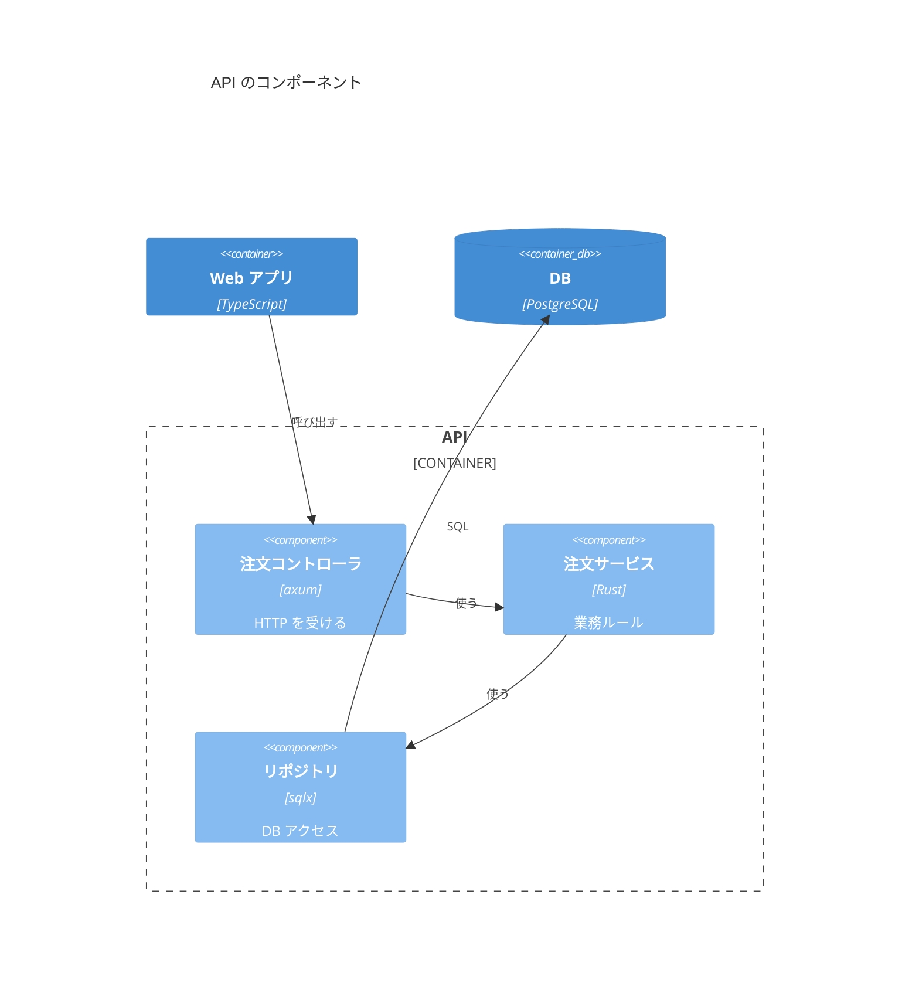
```mermaid
C4Component
  title API のコンポーネント
  Container(web, "Web アプリ", "TypeScript")
  Container_Boundary(api, "API") {
    Component(ctrl, "注文コントローラ", "axum", "HTTP を受ける")
    Component(svc, "注文サービス", "Rust", "業務ルール")
    Component(repo, "リポジトリ", "sqlx", "DB アクセス")
  }
  ContainerDb(db, "DB", "PostgreSQL")
  Rel(web, ctrl, "呼び出す")
  Rel(ctrl, svc, "使う")
  Rel(svc, repo, "使う")
  Rel(repo, db, "SQL")
```
~~~~

## 線の重なり・余白を調整する
Mermaid の C4 は自動レイアウトしない。要素は書いた順に横へ並ぶので、`UpdateLayoutConfig` で 1 行の個数を変え、`UpdateRelStyle` でラベル位置をずらす。
~~~~example
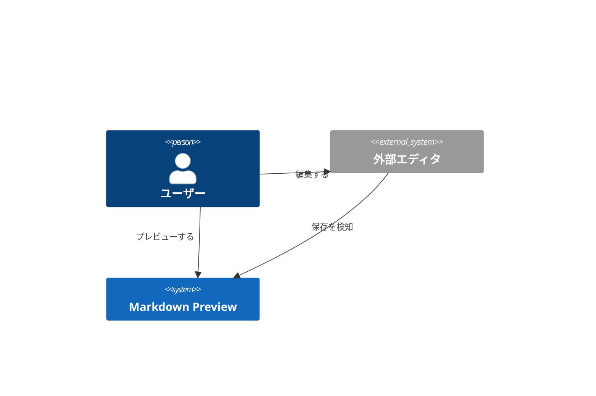
```mermaid
C4Context
  Person(user, "ユーザー")
  System_Ext(editor, "外部エディタ")
  System(app, "Markdown Preview")
  Rel(user, editor, "編集する")
  Rel(user, app, "プレビューする")
  Rel(editor, app, "保存を検知")
  UpdateRelStyle(user, app, $offsetX="-90", $offsetY="-10")
  UpdateLayoutConfig($c4ShapeInRow="2", $c4BoundaryInRow="1")
```
~~~~

## 要素の色を変える
~~~~example
```mermaid
C4Context
  System(a, "通常のシステム")
  System(b, "注目するシステム")
  UpdateElementStyle(b, $bgColor="#d1242f", $borderColor="#82071e")
  Rel(a, b, "連携")
```
~~~~

# Graphviz {#graphviz}

## 有向グラフの基本
```` ```dot ```` または ```` ```graphviz ```` で囲む。`rankdir=LR` で左→右。
~~~~example
```dot
digraph G {
  rankdir=LR;
  開始 -> 処理 -> 終了;
  処理 -> エラー [label="失敗", color=red];
}
```
~~~~

## ノードの形と装飾
~~~~example
```dot
digraph G {
  node [fontname="sans-serif"];
  a [shape=box, style="rounded,filled", fillcolor="#dbeafe", label="角丸"];
  b [shape=ellipse, label="楕円"];
  c [shape=diamond, label="判定"];
  d [shape=cylinder, label="DB"];
  e [shape=note, label="メモ"];
  a -> b -> c -> d;
  c -> e [style=dashed];
}
```
~~~~

## クラスタ（グループ）
サブグラフ名を `cluster_` で始めると枠で囲まれる。
~~~~example
```dot
digraph G {
  compound=true;
  subgraph cluster_front { label="フロント"; style=rounded; ui; router; }
  subgraph cluster_back  { label="バック"; style=rounded; api; db [shape=cylinder]; }
  ui -> router -> api -> db;
}
```
~~~~

## 無向グラフ
~~~~example
```dot
graph G {
  layout=circo;
  A -- B -- C -- D -- A;
  A -- C;
}
```
~~~~

## レコード（表形式のノード）
~~~~example
```dot
digraph G {
  node [shape=record];
  user [label="{users|id: int\lname: text\l}"];
  order [label="{orders|id: int\luser_id: int\l}"];
  order -> user [label="user_id"];
}
```
~~~~

# WaveDrom {#wavedrom}

## 信号の基本
```` ```wavedrom ```` で囲み JSON（JSON5）で書く。1文字が1周期。
`p` クロック、`0` `1` レベル、`x` 不定、`=` `2`〜`9` データ（色違い）、`.` 直前を継続、`|` 省略。
~~~~example
```wavedrom
{ signal: [
  { name: "clk",  wave: "p......." },
  { name: "rst",  wave: "10......" },
  { name: "data", wave: "x.=.=.x.", data: ["A", "B"] },
  { name: "valid", wave: "0.1...0." }
]}
```
~~~~

## グループと区切り
配列で囲むとグループになる。`{}` は空行。
~~~~example
```wavedrom
{ signal: [
  { name: "clk", wave: "p....." },
  {},
  ["送信",
    { name: "tx",  wave: "x345x.", data: ["a", "b", "c"] },
    { name: "req", wave: "01..0." }
  ],
  ["受信",
    { name: "ack", wave: "0.1..0" }
  ]
]}
```
~~~~

## 矢印（エッジ）
`node` に付けた文字同士を `edge` でつなぐ。
~~~~example
```wavedrom
{ signal: [
  { name: "req", wave: "01..0.", node: ".a..." },
  { name: "ack", wave: "0.1..0", node: "..b.." }
],
  edge: ["a~>b 応答"]
}
```
~~~~

## レジスタ図
~~~~example
```wavedrom
{ reg: [
  { bits: 7, name: "opcode", attr: "OP" },
  { bits: 5, name: "rd" },
  { bits: 3, name: "funct3" },
  { bits: 5, name: "rs1" },
  { bits: 12, name: "imm" }
]}
```
~~~~

# このアプリの使い方 {#app}

## キーボードショートカット
~~~~example
| キー | 動作 |
|---|---|
| Ctrl+N / Ctrl+O | 新規 / 開く |
| Ctrl+S / Ctrl+Shift+S | 保存 / 名前を付けて保存 |
| Ctrl+P | PDF プレビュー（確認してから「保存」） |
| Ctrl+1 / 2 / 3 | 編集 / 分割 / プレビュー（編集から切り替えると編集位置を表示・色付け。色はツールバーの「設定」で変更） |
| Ctrl+ホイール | マウスの下のペインを拡大縮小 |
| Ctrl+＋ / Ctrl+− / Ctrl+0 | 拡大 / 縮小 / 100% |
| Ctrl+F（エディタ） | 検索・置換 |
| Ctrl+, | 設定（テーマ・編集位置の色付け・更新） |
| F1 | このヘルプ |
| ツールバーの ◐ / ☀ / ☾ | テーマ（自動 / ライト / ダーク）を切り替え |
| F5 | ファイルを再読み込み |
~~~~

## 画像の貼り付け
~~~~example
1. スクリーンショットなどをクリップボードにコピー
2. エディタ（編集 / 分割モード）で **Ctrl+V**
3. `` が挿入される
4. **Ctrl+S** で保存すると、md と同じフォルダの `assets/` に画像が書き出される
~~~~

## PDF に出力する
~~~~example
1. ツールバーの **PDF** か **Ctrl+P** でプレビューを表示
2. 内容を確認して **保存…**（Ctrl+S）で保存先を選ぶ
3. 紙に印刷したいときはプレビュー右上の印刷ボタン

ダークモードで表示していても、PDF は白地で出力される。
~~~~

## バージョンアップ
~~~~example
- 起動時に GitHub の最新リリースを確認し、新しいバージョンがあれば画面上部にお知らせが出る
- **更新して再起動** で、ダウンロード・インストール・再起動まで自動で行われる
- 手動で確認するときは、ツールバーの **設定**（Ctrl+,）の **更新を確認**
- 自動確認は **設定** の「起動時に自動で更新を確認」で止められる（オフラインのときは何も表示されない）
~~~~

## 外部エディタとの併用
~~~~example
- VS Code などで md を編集・保存すると、プレビューが自動で更新される
- このアプリでも編集中（未保存）のときは、上部のバナーで「再読み込み / 無視」を選べる
- `.md` ファイルをウィンドウにドラッグ＆ドロップしても開ける
~~~~
